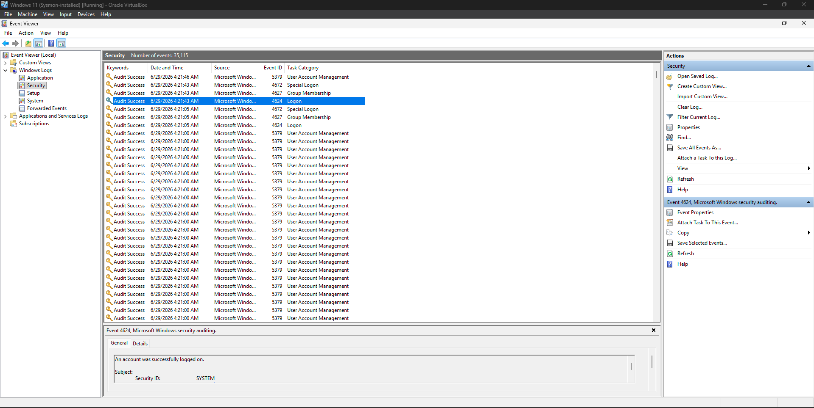

# Windows Security Logs

## Objective

The objective of this lab is to understand Windows Security Logs and learn how security-related events are recorded in the Windows operating system. This exercise focuses on authentication events, important Windows Event IDs, and how SOC analysts use these logs to detect suspicious activities.

---

## What are Windows Security Logs?

Windows Security Logs record authentication, authorization, account management, and other security-related events generated by the operating system. These logs help security professionals monitor user activity, investigate incidents, and detect unauthorized access attempts.

---

## Common Security Events

Windows Security Logs record various security events, including:

* Successful user logins
* Failed login attempts
* Account lockouts
* User account creation and deletion
* Group membership changes
* Privilege escalation
* Security policy modifications

---

## Important Event IDs

| Event ID | Description                                  |
| -------- | -------------------------------------------- |
| **4624** | Successful Logon                             |
| **4625** | Failed Logon                                 |
| **4672** | Special privileges assigned to a new logon   |
| **4732** | User added to a security-enabled local group |
| **4740** | Account locked out                           |

---

## Log Location

Open **Event Viewer** and navigate to:

```text
Windows Logs
└── Security
```

---

## Activities Performed

During this lab, I:

* Opened Windows Event Viewer.
* Navigated to the Security log.
* Explored authentication-related events.
* Reviewed Event ID **4624** (Successful Logon).
* Examined event details recorded by Windows Security Auditing.

---

## SOC Analyst Perspective

Windows Security Logs help SOC analysts:

* Monitor authentication activity
* Detect brute-force attacks
* Investigate failed logins
* Track privilege escalation
* Investigate suspicious user activity
* Support incident response investigations

---

## Key Learnings

* Understood the purpose of Windows Security Logs.
* Learned common Windows Event IDs.
* Explored authentication events using Event Viewer.
* Recognized the importance of Windows logs during security investigations.

---

## Conclusion

Windows Security Logs provide valuable insight into authentication and account activity within a Windows environment. Reviewing these logs enables SOC analysts to identify suspicious behavior, investigate incidents, and strengthen an organization's security posture.

---

## Screenshot

The following screenshot shows a successful login event (Event ID **4624**) captured from Windows Event Viewer.



