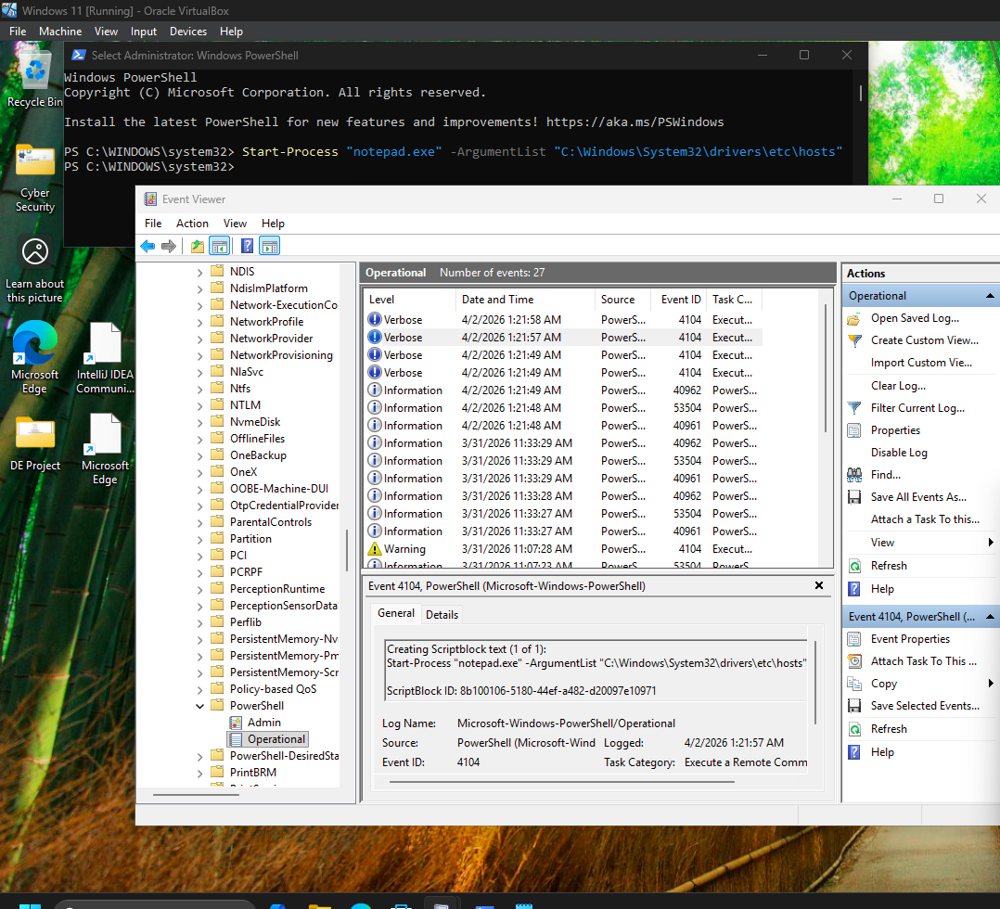

# Windows PowerShell Logs

## Objective

The objective of this lab is to understand Windows PowerShell logging and learn how PowerShell execution events are recorded in Windows Event Viewer. This exercise focuses on identifying PowerShell Script Block Logging (Event ID 4104) and understanding how SOC analysts use these logs to detect suspicious or malicious PowerShell activity.

---

## What are Windows PowerShell Logs?

Windows PowerShell logs record information about PowerShell commands and scripts executed on a system. These logs provide visibility into administrative activities and can help identify malicious PowerShell usage during security investigations.

PowerShell logging is an important source of telemetry for SOC analysts because attackers frequently abuse PowerShell to execute commands, download payloads, and establish persistence.

---

## Important PowerShell Event IDs

| Event ID | Description                                            |
| -------- | ------------------------------------------------------ |
| **4104** | Script Block Logging (Executed PowerShell commands)    |
| **4103** | Module Logging                                         |
| **4101** | PowerShell command execution events                    |
| **4698** | Scheduled Task Creation (often related to persistence) |

---

## Lab Environment

| Component        | Details                                  |
| ---------------- | ---------------------------------------- |
| Operating System | Windows 11                               |
| Tool             | Windows PowerShell                       |
| Log Viewer       | Windows Event Viewer                     |
| Event Log        | Microsoft-Windows-PowerShell/Operational |

---

## Command Executed

```powershell
Start-Process "notepad.exe" -ArgumentList "C:\Windows\System32\drivers\etc\hosts"
```

This command launches Notepad and opens the Windows **hosts** file, generating a PowerShell Script Block Logging event.

---

## Activities Performed

During this lab, I:

* Opened Windows PowerShell with administrative privileges.
* Executed the `Start-Process` command.
* Opened Windows Event Viewer.
* Navigated to **Applications and Services Logs → Microsoft → Windows → PowerShell → Operational**.
* Reviewed the generated **Event ID 4104** entry.
* Verified the executed PowerShell command recorded in the event details.

---

## SOC Analyst Perspective

PowerShell logs help SOC analysts to:

* Detect suspicious PowerShell activity.
* Identify command execution by users.
* Investigate post-exploitation techniques.
* Detect Living-off-the-Land (LOLBins) activity.
* Support threat hunting and incident response.

---

## Key Learnings

* Learned how PowerShell execution is recorded in Windows.
* Explored PowerShell Operational logs.
* Identified Event ID **4104**.
* Understood the importance of Script Block Logging during security investigations.

---

## Conclusion

Windows PowerShell logs provide detailed visibility into PowerShell command execution. Monitoring Event ID 4104 enables SOC analysts to detect suspicious scripts, investigate attacker behavior, and improve endpoint security monitoring.

---

## Screenshot

The following screenshot shows a PowerShell Script Block Logging event (Event ID **4104**) captured from Windows Event Viewer after executing the PowerShell command.


