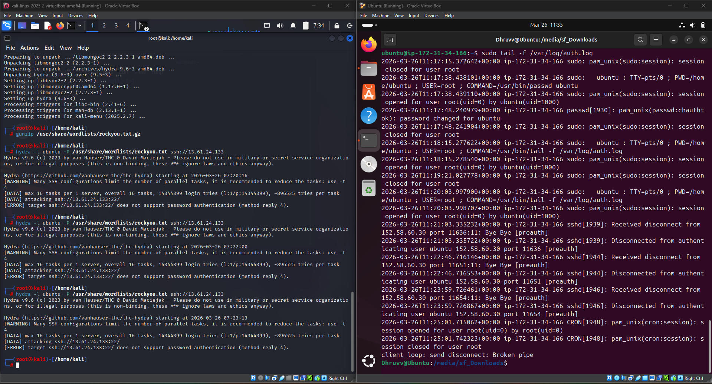

# Linux Authentication Logs

## Objective

The objective of this lab is to understand how Linux authentication logs can be used to monitor SSH activity and identify suspicious authentication attempts. This exercise demonstrates how SSH connection attempts are recorded in `auth.log` and how SOC analysts can use these logs to investigate potential brute-force attacks.

---

## What are Linux Authentication Logs?

Linux authentication logs record user authentication events such as SSH logins, failed login attempts, privilege escalation using `sudo`, and other authentication-related activities.

On Ubuntu and Debian-based systems, these events are stored in:

```text
/var/log/auth.log
```

These logs are an essential source of information during security monitoring and incident investigations.

---

## What is Hydra?

Hydra is an open-source password auditing and penetration testing tool used to test authentication mechanisms across multiple network protocols.

It supports protocols such as:

* SSH
* FTP
* HTTP
* SMB
* RDP
* Telnet

Security professionals use Hydra in authorized environments to identify weak credentials and evaluate authentication security.

---

## Lab Environment

| Component        | Details             |
| ---------------- | ------------------- |
| Attacker Machine | Kali Linux          |
| Target Machine   | Ubuntu Server       |
| Tool             | Hydra               |
| Log File         | `/var/log/auth.log` |
| Protocol         | SSH                 |

---

## Commands Executed

Attack simulation:

```bash
hydra -l ubuntu -P /usr/share/wordlists/rockyou.txt ssh://<TARGET-IP>
```

Monitor authentication logs:

```bash
sudo tail -f /var/log/auth.log
```

---

## Lab Procedure

1. Opened Kali Linux and prepared Hydra for SSH authentication testing.
2. Executed an SSH authentication attempt against the Ubuntu server.
3. Monitored the authentication logs in real time using `tail -f`.
4. Reviewed SSH-related log entries generated during the connection attempts.
5. Analyzed the recorded authentication events from a SOC analyst's perspective.

---

## Observations

During the lab:

* SSH authentication activity was successfully recorded in `auth.log`.
* Connection and authentication events were generated during the Hydra test.
* The SSH service rejected password authentication, preventing a successful brute-force attempt.
* The authentication logs provided visibility into SSH connection activity and client interactions.

---

## SOC Analyst Perspective

Linux authentication logs help SOC analysts to:

* Monitor SSH authentication attempts
* Detect unauthorized access attempts
* Investigate suspicious login activity
* Identify repeated authentication failures
* Support incident response and forensic investigations

---

## Key Learnings

* Understood how Linux records SSH authentication events.
* Learned how to monitor authentication logs in real time.
* Explored the use of Hydra in a controlled lab environment.
* Gained practical experience analyzing Linux authentication logs from a defensive security perspective.

---

## Conclusion

Linux authentication logs provide valuable visibility into SSH authentication activity and user login events. Continuous monitoring of `auth.log` helps SOC analysts identify suspicious behavior, investigate authentication attempts, and strengthen overall system security.

---

## Screenshot

The following screenshot shows the Hydra authentication attempt from the Kali Linux attacker machine and the corresponding authentication log monitoring on the Ubuntu target machine.


