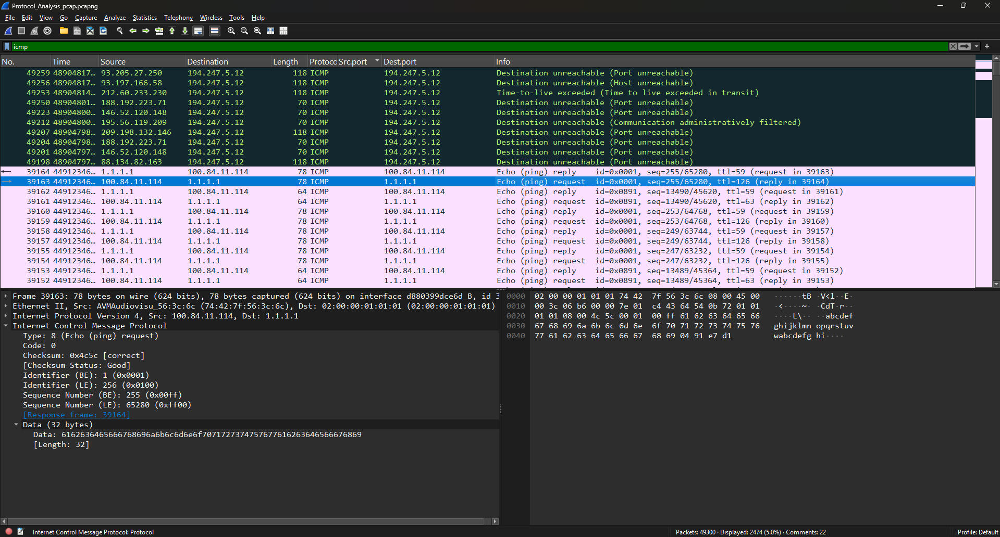

# Introduction to Wireshark

##  Objective

The objective of this lab is to understand the fundamentals of Wireshark and its role in network traffic analysis. This exercise focuses on analyzing captured network packets, applying display filters, inspecting protocol details, and understanding how SOC analysts use packet captures during security investigations.

---

##  What is Wireshark?

Wireshark is a powerful open-source network protocol analyzer used to capture and inspect network traffic. It enables security professionals to analyze packets in real time or from previously captured packet capture (PCAP) files.

Wireshark is widely used for troubleshooting network issues, investigating security incidents, malware analysis, and threat hunting.

---

## Why Wireshark is Important for SOC Analysts

Wireshark helps SOC analysts to:

* Investigate suspicious network activity.
* Analyze communication between hosts.
* Detect malicious or abnormal traffic.
* Examine protocol behavior.
* Support incident response and forensic investigations.

---

##  Lab Environment

| Component         | Details                  |
| ----------------- | ------------------------ |
| Tool              | Wireshark                |
| Capture File      | Protocol_Analysis.pcapng |
| Operating System  | Windows                  |
| Protocol Analyzed | ICMP                     |

---

## Activities Performed

During this lab, I:

* Opened the provided PCAP file in Wireshark.
* Explored the Wireshark interface and packet panes.
* Applied an ICMP display filter to isolate ICMP traffic.
* Examined packet details and protocol fields.
* Reviewed endpoint statistics to identify communicating hosts.

---

##  Key Features Explored

* Packet List Pane
* Packet Details Pane
* Packet Bytes Pane
* Display Filters
* Statistics → Endpoints
* Protocol Inspection

---

##  SOC Analyst Perspective

Wireshark enables SOC analysts to inspect network communications at the packet level. During investigations, it helps identify suspicious connections, analyze protocol behavior, detect anomalies, and extract valuable indicators that support threat detection and incident response.

---

##  Key Learnings

* Learned the Wireshark interface and navigation.
* Applied display filters to isolate network traffic.
* Explored ICMP packet structures.
* Analyzed packet details and endpoint statistics.
* Understood the role of packet analysis in cybersecurity investigations.

---

##  Conclusion

Wireshark provides deep visibility into network communications and is an essential tool for SOC analysts. Understanding how to inspect packets, apply filters, and analyze protocol behavior is a fundamental skill for network security monitoring and incident investigation.

---

## 📸 Screenshots

### Wireshark Interface

The following screenshot shows the Wireshark interface used to inspect captured network traffic and explore packet analysis features.

