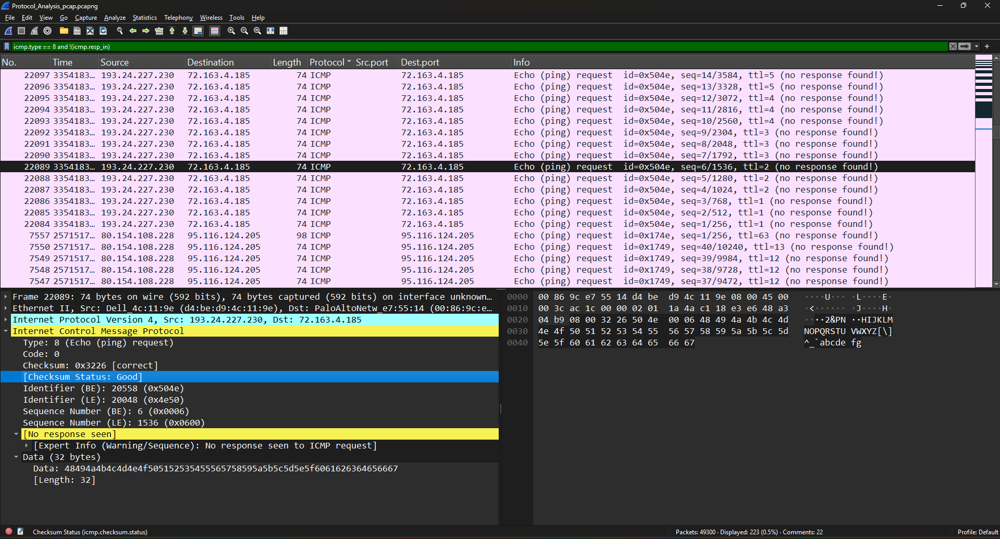
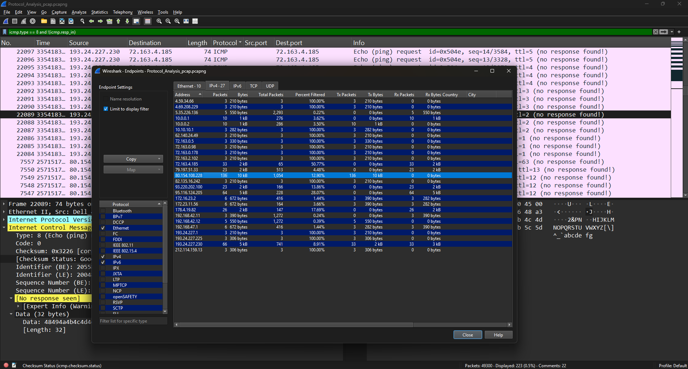

# ICMP Protocol Analysis

## Objective

The objective of this lab is to understand the Internet Control Message Protocol (ICMP) and analyze ICMP traffic using Wireshark. This exercise focuses on identifying Echo Request and Echo Reply packets, examining ICMP header fields, and understanding how ICMP is used for network diagnostics and security monitoring.

---

## What is ICMP?

Internet Control Message Protocol (ICMP) is a Layer 3 protocol used by network devices to exchange error messages and operational information. It is commonly used by tools such as **ping** and **traceroute** to verify connectivity and diagnose network issues.

Unlike TCP and UDP, ICMP does not carry application data. Instead, it provides feedback about network communication and connectivity.

---

## Common ICMP Message Types

| Type   | Description             |
| ------ | ----------------------- |
| **0**  | Echo Reply              |
| **8**  | Echo Request            |
| **3**  | Destination Unreachable |
| **11** | Time Exceeded           |

---

## Lab Environment

| Component        | Details                  |
| ---------------- | ------------------------ |
| Tool             | Wireshark                |
| Capture File     | Protocol_Analysis.pcapng |
| Operating System | Windows                  |
| Protocol         | ICMP                     |

---

## Display Filters Used

```text
icmp
icmp.type == 8
icmp.type == 0
```

---

## Lab Procedure

1. Opened the packet capture in Wireshark.
2. Applied the **ICMP** display filter.
3. Located Echo Request and Echo Reply packets.
4. Examined ICMP packet headers and protocol fields.
5. Reviewed endpoint statistics to analyze communication between hosts.

---

## Observations

During the analysis:

* ICMP Echo Request and Echo Reply packets were identified.
* Packet details such as Type, Code, Identifier, and Sequence Number were examined.
* Endpoint statistics provided visibility into communicating hosts.
* ICMP traffic demonstrated successful network communication between systems.

---

## SOC Analyst Perspective

ICMP traffic analysis helps SOC analysts:

* Detect network reconnaissance activities.
* Identify ping sweeps and host discovery attempts.
* Investigate network connectivity issues.
* Support threat hunting and incident response.

---

## Key Learnings

* Understood the purpose of the ICMP protocol.
* Learned to apply ICMP display filters.
* Analyzed Echo Request and Echo Reply packets.
* Examined protocol fields and packet details.
* Interpreted endpoint statistics using Wireshark.

---

## Conclusion

ICMP analysis is a fundamental skill for network traffic investigation. Understanding ICMP communication enables SOC analysts to identify network reconnaissance, troubleshoot connectivity issues, and perform effective packet-level analysis.

---

## 📸 Screenshots

### ICMP Packet Analysis

The following screenshot demonstrates ICMP packet inspection using Wireshark.



### ICMP Endpoint Statistics

The following screenshot shows endpoint statistics generated from the captured ICMP traffic.


