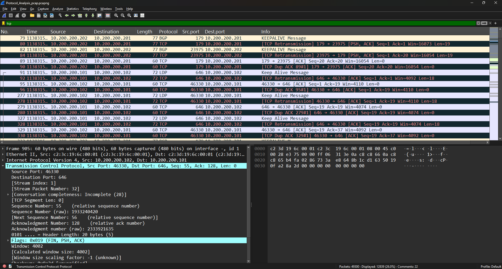
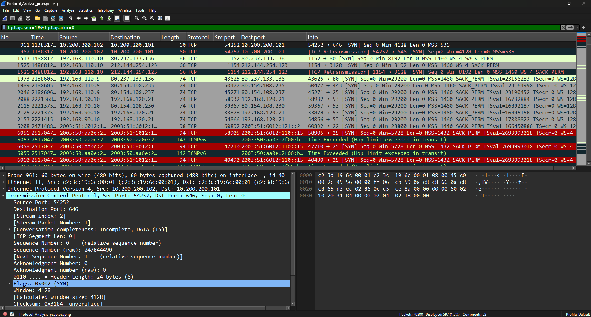
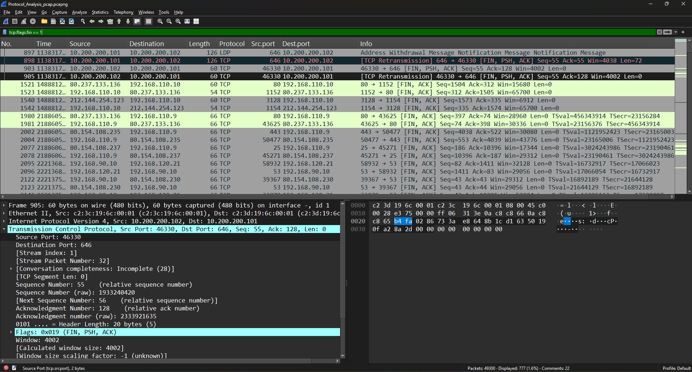
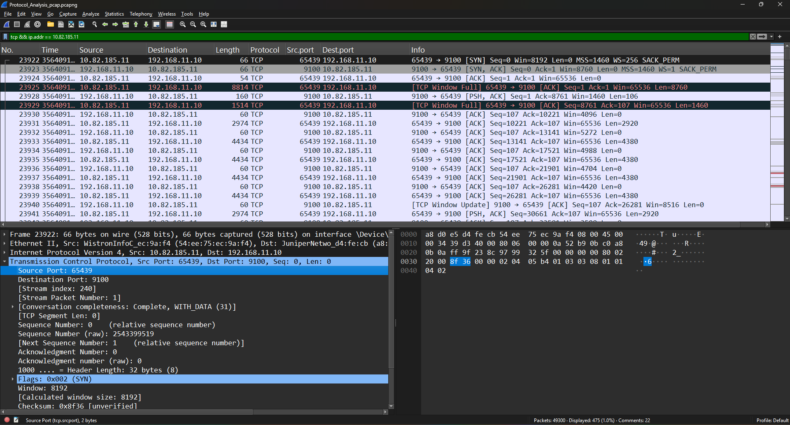

# TCP Protocol Analysis

## Objective

The objective of this lab is to analyze Transmission Control Protocol (TCP) traffic using Wireshark. This exercise focuses on understanding TCP communication, connection establishment, connection termination, and packet analysis using common TCP display filters.

---

## What is TCP?

Transmission Control Protocol (TCP) is a Layer 4 transport protocol that provides reliable, connection-oriented communication between network devices. TCP ensures ordered data delivery, error recovery, and retransmission of lost packets, making it one of the most widely used protocols for network communication.

---

## Common TCP Flags

| Flag    | Description                               |
| ------- | ----------------------------------------- |
| **SYN** | Initiates a TCP connection                |
| **ACK** | Acknowledges received packets             |
| **FIN** | Gracefully terminates a connection        |
| **RST** | Immediately resets a connection           |
| **PSH** | Delivers buffered data to the application |
| **URG** | Indicates urgent data                     |

---

## Lab Environment

| Component        | Details                  |
| ---------------- | ------------------------ |
| Tool             | Wireshark                |
| Capture File     | Protocol_Analysis.pcapng |
| Operating System | Windows                  |
| Protocol         | TCP                      |

---

## Display Filters Used

```text
tcp
tcp.flags.syn == 1
tcp.flags.fin == 1
tcp && ip.addr == 10.82.185.11
```

---

## Lab Procedure

1. Opened the packet capture in Wireshark.
2. Applied the `tcp` display filter to inspect TCP traffic.
3. Filtered SYN packets to observe connection establishment.
4. Filtered FIN packets to analyze connection termination.
5. Filtered TCP traffic associated with a specific host IP address.
6. Examined TCP header fields, flags, ports, sequence numbers, and acknowledgments.

---

## Observations

During the analysis:

* General TCP communication between multiple hosts was observed.
* SYN packets identified the beginning of TCP sessions.
* FIN packets demonstrated graceful connection termination.
* Host-based filtering isolated TCP traffic related to a specific IP address.
* TCP header fields such as Source Port, Destination Port, Sequence Number, Acknowledgment Number, and Flags were successfully analyzed.

---

## SOC Analyst Perspective

TCP analysis enables SOC analysts to:

* Investigate suspicious network connections.
* Identify scanning activity and connection attempts.
* Detect retransmissions and abnormal communication.
* Analyze session establishment and termination.
* Support network forensics and incident response.

---

## Key Learnings

* Understood TCP connection-oriented communication.
* Learned to identify SYN and FIN packets.
* Applied multiple TCP display filters in Wireshark.
* Examined TCP packet headers and flags.
* Performed host-specific traffic analysis.

---

## Conclusion

TCP protocol analysis provides valuable insight into network communications and connection behavior. Understanding TCP flags, packet structure, and traffic patterns helps SOC analysts investigate suspicious activity, troubleshoot network issues, and support security monitoring.

---

## 📸 Screenshots

### TCP Packet Analysis

The following screenshot shows general TCP traffic captured in Wireshark.



### SYN Packet Analysis

The following screenshot demonstrates TCP SYN packets used during connection establishment.



### FIN Packet Analysis

The following screenshot demonstrates TCP FIN packets used during graceful connection termination.



### Host-Based TCP Analysis

The following screenshot shows TCP traffic filtered for a specific host IP address.


