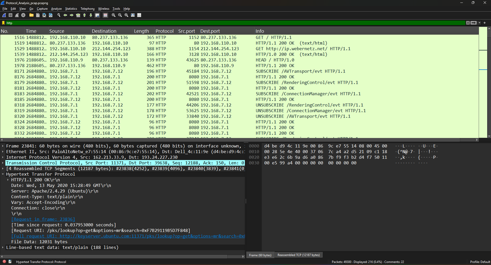
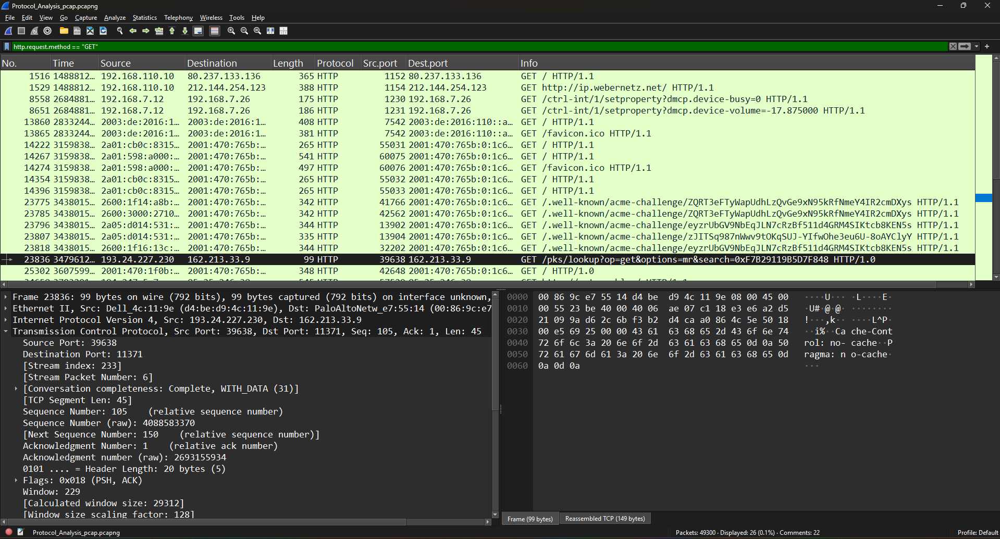
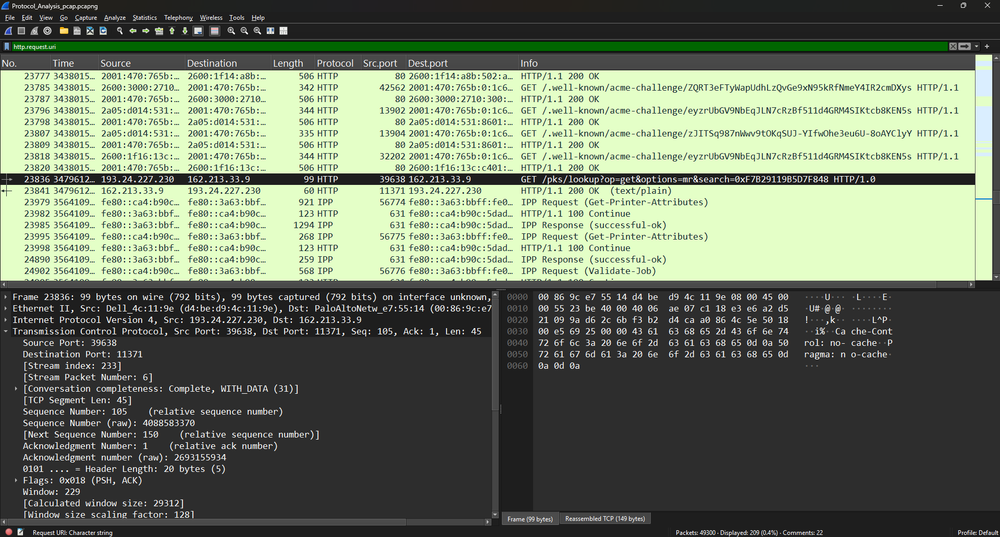

# HTTP Protocol Analysis

## Objective

The objective of this lab is to analyze Hypertext Transfer Protocol (HTTP) traffic using Wireshark. This exercise focuses on understanding HTTP requests and responses, inspecting web communication, and identifying important HTTP fields that can assist SOC analysts during network investigations.

---

## What is HTTP?

Hypertext Transfer Protocol (HTTP) is an application-layer protocol used for communication between web clients and web servers. It enables browsers to request web resources such as HTML pages, images, scripts, and files.

Because HTTP traffic is transmitted in plaintext, it can be inspected to understand client-server communication and identify potentially suspicious activity.

---

## Common HTTP Methods

| Method     | Description                           |
| ---------- | ------------------------------------- |
| **GET**    | Requests a resource from a web server |
| **POST**   | Sends data to a web server            |
| **PUT**    | Updates an existing resource          |
| **DELETE** | Removes a resource                    |
| **HEAD**   | Retrieves response headers only       |

---

## Lab Environment

| Component        | Details                  |
| ---------------- | ------------------------ |
| Tool             | Wireshark                |
| Capture File     | Protocol_Analysis.pcapng |
| Operating System | Windows                  |
| Protocol         | HTTP                     |

---

## Display Filters Used

```text
http
http.request.method == "GET"
http.request.uri
```

---

## Lab Procedure

1. Opened the packet capture in Wireshark.
2. Applied the `http` display filter to isolate HTTP traffic.
3. Identified HTTP GET requests generated by the client.
4. Examined requested resources using the request URI filter.
5. Reviewed HTTP headers and request information.

---

## Observations

During the analysis:

* HTTP packets were successfully filtered and inspected.
* GET requests identified resources requested by the client.
* Request URI values showed the specific resources accessed.
* HTTP communication was readable because the traffic was not encrypted.

---

## SOC Analyst Perspective

HTTP analysis enables SOC analysts to:

* Detect suspicious web requests.
* Investigate unauthorized resource access.
* Identify malicious downloads or command-and-control communication.
* Detect sensitive information transmitted over unencrypted HTTP.
* Support network forensic investigations.

---

## Key Learnings

* Understood how HTTP communication works.
* Learned to analyze HTTP requests using Wireshark.
* Applied HTTP display filters.
* Examined GET requests and requested resources.
* Gained practical experience inspecting application-layer traffic.

---

## Conclusion

HTTP traffic analysis provides valuable insight into web communication between clients and servers. Understanding HTTP requests, headers, and requested resources helps SOC analysts investigate suspicious activity, identify security risks, and perform effective network traffic analysis.

---

## 📸 Screenshots

### HTTP Traffic Analysis

The following screenshot shows HTTP packets captured and filtered using Wireshark.



### HTTP GET Request Analysis

The following screenshot demonstrates HTTP GET requests captured during network communication.



### HTTP Requested Resource Analysis

The following screenshot shows the requested resources identified from HTTP request URIs.


