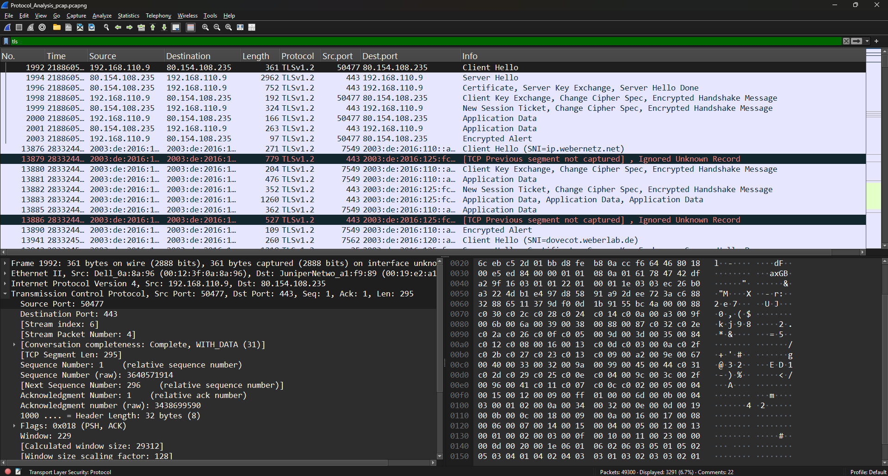
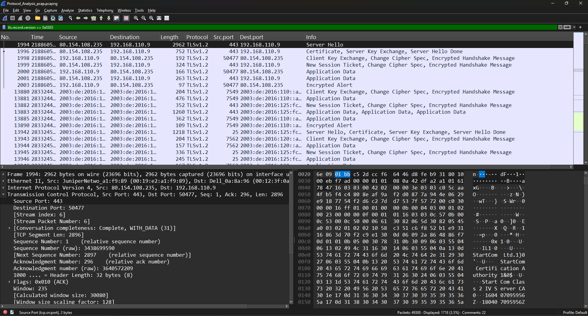

# TLS Protocol Analysis with Wireshark

## Objective

The objective of this lab was to analyze Transport Layer Security (TLS) traffic using Wireshark. The exercise focused on identifying TLS handshake messages, examining protocol metadata, and understanding how TLS establishes secure communication over HTTPS.

---

## What is TLS?

Transport Layer Security (TLS) is a cryptographic protocol designed to provide confidentiality, integrity, and authentication for data transmitted across a network. It is the successor to SSL and is widely used to secure web traffic (HTTPS), email services, VPNs, and other network applications.

Before encrypted communication begins, the client and server perform a TLS handshake to negotiate the protocol version, cipher suite, exchange cryptographic information, and establish a secure session.

---

## Lab Environment

* **Operating System:** Windows 10/11
* **Tool Used:** Wireshark
* **Protocol Analyzed:** TLS
* **Transport Protocol:** TCP
* **Common Port:** 443 (HTTPS)

---

## Display Filters Used

| Display Filter                 | Purpose                                 |
| ------------------------------ | --------------------------------------- |
| `tls`                          | Display all TLS traffic                 |
| `tls.handshake.type == 1`      | Display Client Hello handshake messages |
| `tls.record.version == 0x0303` | Display TLS 1.2 traffic                 |

---

## Lab Procedure

1. Opened the provided packet capture (PCAP) file in Wireshark.
2. Applied the `tls` display filter to identify all TLS packets.
3. Filtered Client Hello messages using `tls.handshake.type == 1`.
4. Applied the TLS 1.2 filter using `tls.record.version == 0x0303`.
5. Observed the TLS handshake process and verified protocol metadata available within encrypted traffic.

---

## Observations

* TLS traffic was successfully identified using the `tls` display filter.
* Client Hello packets revealed the beginning of secure session negotiation.
* TLS 1.2 packets were identified using the protocol version filter.
* Although the encrypted application data could not be viewed, Wireshark displayed valuable metadata including handshake messages, protocol versions, and connection details.

---

## SOC Analyst Perspective

From a SOC analyst's perspective, TLS traffic analysis is valuable even when payloads remain encrypted. Analysts can examine handshake metadata to identify:

* Supported TLS protocol versions
* Client Hello and Server Hello exchanges
* Potential use of outdated TLS versions
* Suspicious encrypted communications
* Certificate-related information
* Indicators of encrypted command-and-control (C2) communications

Understanding TLS metadata helps security teams detect abnormal encrypted traffic without requiring decryption.

---

## Key Learnings

* Learned how TLS secures network communications using encryption.
* Identified TLS traffic using Wireshark display filters.
* Observed Client Hello handshake messages.
* Filtered and identified TLS 1.2 traffic.
* Understood that encrypted payloads remain unreadable without session keys, while protocol metadata remains available for analysis.
* Recognized the importance of TLS metadata during network security investigations.

---

## Conclusion

This lab provided practical experience analyzing TLS traffic with Wireshark. By applying protocol-specific display filters, it was possible to examine TLS handshake messages and identify TLS 1.2 communications without decrypting the encrypted payload. The exercise demonstrated how metadata exposed during the TLS handshake can support security monitoring and incident investigations while maintaining encrypted communications.

---

## 📸 Screenshots

### 1. All TLS Traffic

Applied the `tls` display filter to display all TLS packets captured in the network traffic.

---

### 2. Client Hello Messages

Filtered Client Hello handshake packets using the `tls.handshake.type == 1` display filter to observe the initiation of the TLS handshake.

---

### 3. TLS 1.2 Traffic

Applied the `tls.record.version == 0x0303` display filter to identify packets using the TLS 1.2 protocol version.

