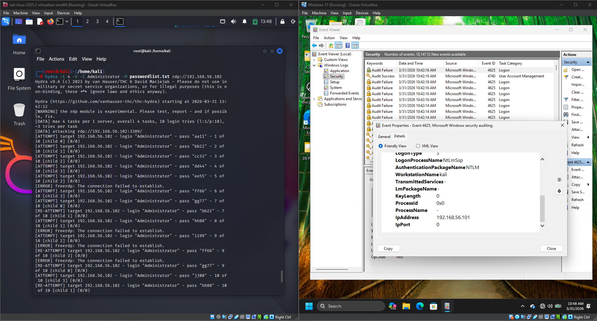
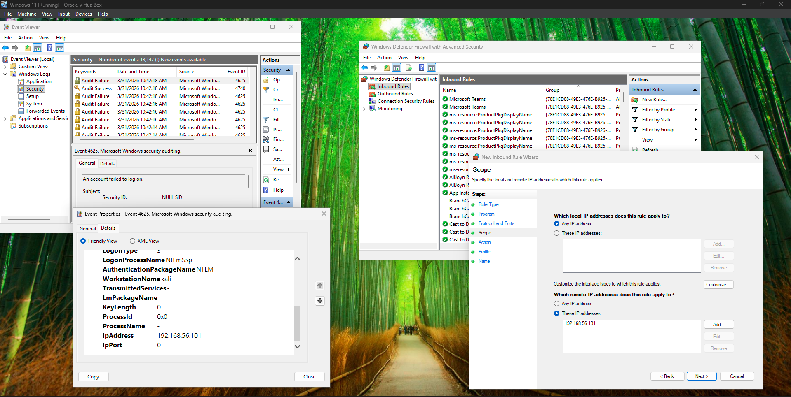

# Introduction to Incident Response – Windows RDP Brute Force Detection

## Objective

The objective of this lab was to understand the fundamentals of Incident Response (IR) by simulating an RDP brute-force attack against a Windows system, detecting the attack through Windows Event Viewer, and performing a basic containment action by blocking the attacker's IP address using Windows Defender Firewall.

---

## What is Incident Response?

Incident Response (IR) is a structured approach used to identify, analyze, contain, eradicate, and recover from cybersecurity incidents. It enables security teams to minimize the impact of attacks while restoring normal operations efficiently.

The standard Incident Response lifecycle consists of:

* Preparation
* Detection and Analysis
* Containment, Eradication, and Recovery
* Post-Incident Activity

---

## Lab Environment

| Component        | Details                   |
| ---------------- | ------------------------- |
| Attacker Machine | Kali Linux                |
| Target Machine   | Windows 11                |
| Attack Tool      | Hydra                     |
| Detection Tool   | Windows Event Viewer      |
| Containment Tool | Windows Defender Firewall |
| Attack Type      | RDP Brute Force           |
| Protocol         | RDP (TCP/3389)            |

---

## Commands Used

```bash
hydra -t 4 -V -l Administrator -P passwordlist.txt rdp://192.168.56.102
```

---

## Lab Procedure

1. Enabled Remote Desktop on the Windows target machine.
2. Opened **Windows Event Viewer** and monitored the **Security** log.
3. Launched an RDP brute-force attack from the Kali Linux machine using Hydra.
4. Observed multiple failed login attempts generated by the attack.
5. Verified **Event ID 4625 (Failed Logon)** entries in Windows Event Viewer.
6. Confirmed the attacker's IP address from the event details.
7. Created a Windows Defender Firewall inbound rule to block the attacker's IP address.

---

## Observations

* Hydra generated repeated authentication attempts against the RDP service.
* Windows Security logs recorded multiple **Event ID 4625 (Failed Logon)** events.
* Event details showed the source workstation and IP address responsible for the failed logins.
* A firewall rule was successfully configured to block further inbound connections from the attacker's IP address.

---

## Incident Response Actions Performed

### Detection

* Identified repeated failed RDP login attempts.
* Verified Event ID **4625** in Windows Event Viewer.
* Correlated the attack with the source IP address.

### Analysis

* Confirmed the failed authentication attempts originated from the Kali Linux system.
* Determined the activity was consistent with an RDP brute-force attack.

### Containment

* Created a Windows Defender Firewall rule to block the attacker's IP address.

### Recovery

* Verified that the Windows system remained accessible after implementing the containment action.

---

## SOC Analyst Perspective

Repeated failed authentication attempts are common indicators of brute-force attacks. Monitoring Windows Security logs for Event ID **4625** allows SOC analysts to quickly detect suspicious login activity, identify the attack source, and take immediate containment actions such as blocking malicious IP addresses or disabling compromised accounts.

---

## Key Learnings

* Understood the Incident Response lifecycle.
* Simulated an RDP brute-force attack using Hydra.
* Investigated failed logon events in Windows Event Viewer.
* Identified Event ID **4625** as evidence of failed authentication attempts.
* Correlated attack activity using the source IP address.
* Performed a basic containment action by creating a Windows Defender Firewall rule.

---

## Conclusion

This lab provided practical experience with the initial stages of Incident Response by simulating and investigating an RDP brute-force attack. Using Windows Event Viewer and Windows Defender Firewall, the attack was detected, analyzed, and contained, demonstrating how SOC analysts can respond to authentication-based threats in Windows environments.

---

## 📸 Screenshots

### 1. RDP Brute Force Detection

A simulated RDP brute-force attack was performed using Hydra from the Kali Linux machine. Simultaneously, Windows Event Viewer recorded multiple **Event ID 4625 (Failed Logon)** entries, allowing the attack activity to be identified and correlated with the source IP address.



---

### 2. Incident Containment – Windows Firewall Rule

After identifying the attack source, a Windows Defender Firewall inbound rule was configured to block the attacker's IP address, demonstrating a basic containment action during the Incident Response process.



