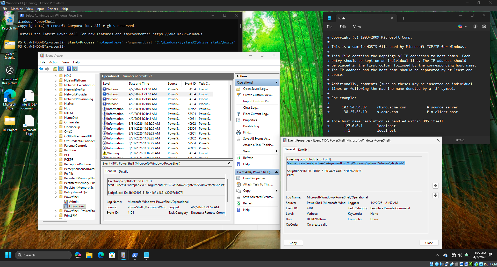

# Detecting Suspicious PowerShell Activity

## Objective

The objective of this lab was to simulate a PowerShell command execution, investigate the generated PowerShell logs using Windows Event Viewer, and understand how SOC analysts detect and analyze PowerShell activity during an incident response investigation.

---

## What is PowerShell Logging?

PowerShell is a powerful Windows administration and automation framework. While it is widely used by administrators, attackers frequently abuse it to execute malicious scripts, download payloads, establish persistence, and perform post-exploitation activities.

PowerShell logging provides visibility into executed commands and scripts, allowing SOC analysts to detect suspicious behavior and investigate security incidents.

The Incident Response lifecycle consists of:

* Preparation
* Detection and Analysis
* Containment, Eradication, and Recovery
* Post-Incident Activity

---

## Lab Environment

| Component          | Details                                  |
| ------------------ | ---------------------------------------- |
| Operating System   | Windows 11                               |
| Tool               | Windows PowerShell                       |
| Log Source         | Windows Event Viewer                     |
| Log Location       | Microsoft-Windows-PowerShell/Operational |
| Event ID Observed  | 4104                                     |
| Investigation Tool | Event Viewer                             |

---

## Commands Used

```powershell
Start-Process "notepad.exe" -ArgumentList "C:\Windows\System32\drivers\etc\hosts"
```

---

## Lab Procedure

1. Opened Windows PowerShell with administrative privileges.
2. Executed a PowerShell command to launch Notepad with the Windows hosts file.
3. Opened Windows Event Viewer.
4. Navigated to **Applications and Services Logs → Microsoft → Windows → PowerShell → Operational**.
5. Located the generated **Event ID 4104** entry.
6. Reviewed the event details, including the executed command, user information, and execution timestamp.
7. Examined the hosts file as part of the investigation process.

---

## Observations

* The PowerShell command execution generated an **Event ID 4104** entry in the Operational log.
* Event details recorded the executed PowerShell command.
* The log included the execution timestamp and the user account responsible for running the command.
* The Windows hosts file was successfully opened using PowerShell, confirming the recorded activity.

---

## SOC Analyst Perspective

PowerShell activity should be continuously monitored because it is frequently used during post-exploitation attacks. Event ID **4104** provides valuable visibility into executed PowerShell script blocks, allowing analysts to identify suspicious commands, investigate user activity, and correlate events with other security logs during incident response.

---

## Key Learnings

* Understood the importance of PowerShell logging in Windows environments.
* Generated PowerShell activity using a legitimate administrative command.
* Investigated PowerShell Operational logs in Windows Event Viewer.
* Identified Event ID **4104** associated with PowerShell command execution.
* Learned how PowerShell logs assist SOC analysts during security investigations.

---

## Conclusion

This lab demonstrated how PowerShell activity can be monitored through Windows Event Viewer. By generating and reviewing Event ID 4104, the exercise highlighted how PowerShell logging supports threat detection, forensic investigations, and incident response by providing detailed visibility into executed commands.

---

## 📸 Screenshots

### 1. PowerShell Command Execution and Event ID 4104 Analysis

The PowerShell command was executed to open the Windows hosts file. The generated **Event ID 4104** was then analyzed in Windows Event Viewer to review the executed command, execution timestamp, and user information.


