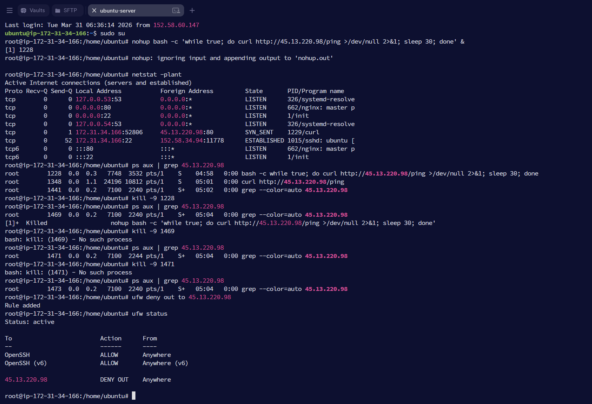

# Suspicious Network Connection

## Objective

The objective of this lab was to investigate a suspicious outbound network connection on a Linux system, identify the responsible process, terminate the malicious activity, and block further communication with the remote IP address as part of the Incident Response process.

---

## What is a Suspicious Network Connection?

Unexpected outbound network connections can indicate malicious activity such as command-and-control (C2) communication, malware beaconing, or data exfiltration. Monitoring active connections and correlating them with running processes helps SOC analysts quickly identify and respond to potential threats.

The Incident Response lifecycle consists of:

* Preparation
* Detection and Analysis
* Containment, Eradication, and Recovery
* Post-Incident Activity

---

## Lab Environment

| Component           | Details                                |
| ------------------- | -------------------------------------- |
| Operating System    | Ubuntu                                 |
| Shell               | Bash                                   |
| Investigation Tools | `netstat`, `ps`, `grep`, `kill`, `ufw` |
| Simulated Activity  | Suspicious Outbound Connection         |
| Firewall            | UFW (Uncomplicated Firewall)           |

---

## Commands Used

```bash
nohup bash -c 'while true; do curl http://45.13.220.98/ping >/dev/null 2>&1; sleep 30; done' &

netstat -plant

ps aux | grep 45.13.220.98

kill -9 1228

ufw deny out to 45.13.220.98

ufw status
```

---

## Lab Procedure

1. Simulated a suspicious outbound network connection using a background Bash process.
2. Examined active network connections using `netstat`.
3. Identified the remote IP address and associated process.
4. Investigated the responsible process using `ps`.
5. Terminated the suspicious process.
6. Configured a UFW outbound firewall rule to block communication with the remote IP address.
7. Verified the firewall configuration.

---

## Observations

* An outbound connection to **45.13.220.98** was detected.
* The connection originated from a Bash process executing a continuous `curl` command.
* Process information was successfully identified using `ps`.
* The suspicious process was terminated.
* A UFW outbound rule was created to block future communication with the remote IP address.

---

## SOC Analyst Perspective

Unexpected outbound connections are common indicators of command-and-control (C2) communication or malware beaconing. During an investigation, SOC analysts identify the associated process, determine whether the connection is legitimate, terminate unauthorized activity, and implement network controls to prevent further communication with suspicious external systems.

---

## Key Learnings

* Learned how to identify active network connections on Linux.
* Correlated network connections with running processes.
* Investigated suspicious outbound traffic using Linux command-line tools.
* Terminated an unauthorized process.
* Applied outbound firewall rules using UFW as a containment measure.
* Understood the importance of monitoring outbound connections during incident response.

---

## Conclusion

This lab demonstrated how suspicious outbound network connections can be investigated and contained on a Linux system. By identifying the responsible process, terminating the activity, and blocking the destination IP using UFW, the exercise reinforced essential Incident Response techniques used by SOC analysts to mitigate potential command-and-control communications.

---

## 📸 Screenshots

### 1. Investigation and Containment of a Suspicious Network Connection

The simulated outbound connection was investigated using `netstat` and `ps`, followed by terminating the associated process and applying a UFW outbound rule to block communication with the suspicious IP address.


