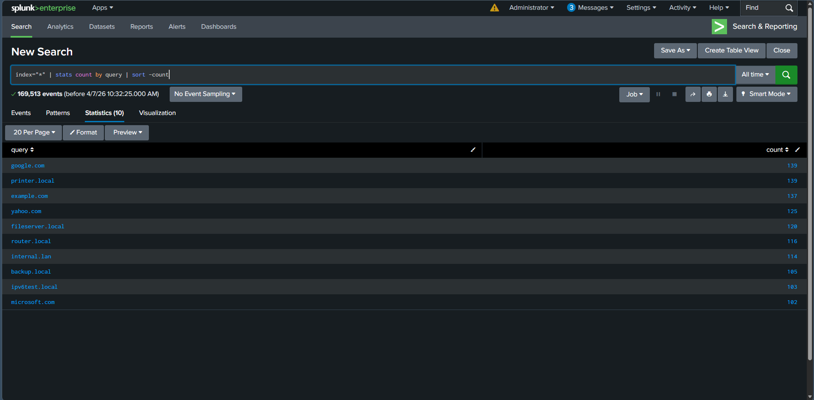
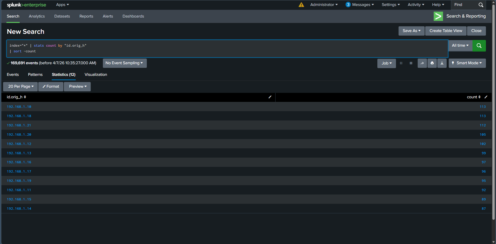
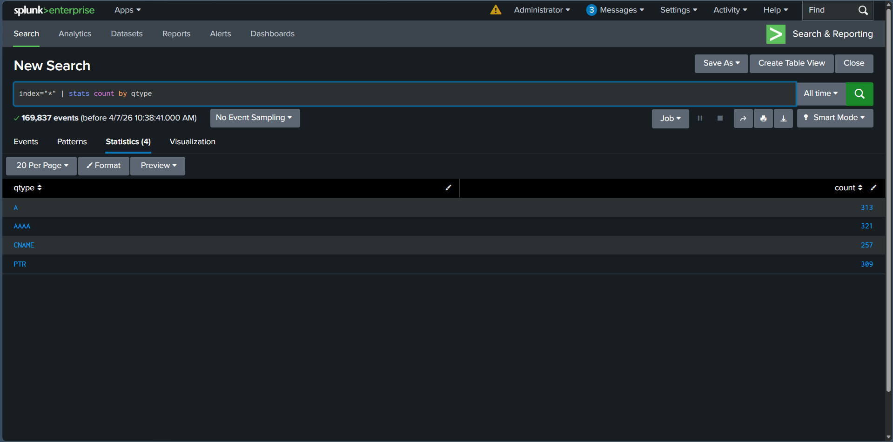

# DNS Log Analysis Using Splunk

## Objective

The objective of this lab was to ingest Zeek DNS logs into Splunk and analyze DNS activity using Search Processing Language (SPL). The lab focused on identifying frequently queried domain names, the most active source IP addresses, and the distribution of DNS query types.

---

## What is DNS Log Analysis?

DNS log analysis is the process of examining Domain Name System (DNS) queries to understand network activity and identify potential security threats. DNS logs can reveal communication with malicious domains, unusual query patterns, data exfiltration attempts, or compromised hosts.

Analyzing DNS logs is a common task for SOC analysts during threat hunting, incident response, and network monitoring.

---

## Lab Environment

| Component     | Details           |
| ------------- | ----------------- |
| SIEM Platform | Splunk Enterprise |
| Data Source   | Zeek DNS Logs     |
| Log Format    | JSON              |
| Index         | `dns_lab`         |
| Sourcetype    | `json`            |

---

## SPL Queries Used

### Task 1 – Identify the Most Frequently Queried Domain Names

```spl
index=dns_lab sourcetype="json"
| stats count by query
| sort -count
```

### Task 2 – Find the Most Active Source IP Addresses

```spl
index=dns_lab sourcetype="json"
| stats count by "id.orig_h"
| sort -count
```

### Task 3 – Analyze DNS Query Types

```spl
index=dns_lab sourcetype="json"
| stats count by qtype
```

---

## Lab Procedure

1. Uploaded the Zeek DNS log file into Splunk.
2. Indexed the data using the `dns_lab` index with the `json` sourcetype.
3. Verified successful log ingestion.
4. Executed SPL queries to analyze DNS activity.
5. Identified the most frequently queried domain names.
6. Determined the hosts generating the highest volume of DNS requests.
7. Reviewed the distribution of DNS query types.

---

## Observations

* DNS logs were successfully ingested into Splunk.
* Frequently queried domain names were identified using aggregation queries.
* Source IP addresses generating the highest number of DNS requests were determined.
* DNS query types such as **A**, **AAAA**, **CNAME**, and **PTR** were analyzed to understand query distribution.

---

## SOC Analyst Perspective

DNS logs provide valuable visibility into network communications and are frequently used during threat hunting and incident response. Monitoring frequently queried domains, identifying hosts with unusual DNS activity, and analyzing query types can help detect malware communications, command-and-control (C2) traffic, DNS tunneling, and other suspicious behaviors.

---

## Key Learnings

* Learned how to ingest JSON-formatted Zeek DNS logs into Splunk.
* Used SPL to analyze DNS activity efficiently.
* Identified the most frequently queried domain names.
* Determined the most active source IP addresses.
* Analyzed DNS query types to better understand network behavior.
* Gained practical experience using Splunk for DNS log investigations.

---

## Conclusion

This lab demonstrated how Splunk can be used to investigate DNS activity by analyzing Zeek DNS logs. Using SPL queries, it was possible to identify common domain queries, active source hosts, and DNS query types, reinforcing the role of DNS analysis in SOC operations and security investigations.

---

## 📸 Screenshots

### 1. Most Frequently Queried Domain Names

The SPL query was used to identify the domain names receiving the highest number of DNS queries.



---

### 2. Most Active Source IP Addresses

The query identified the source IP addresses responsible for generating the highest volume of DNS requests.



---

### 3. DNS Query Type Distribution

The SPL query provided a breakdown of DNS query types observed within the ingested logs.


