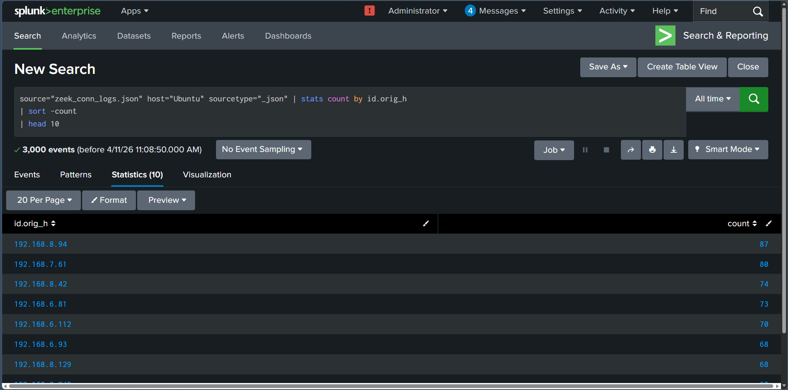
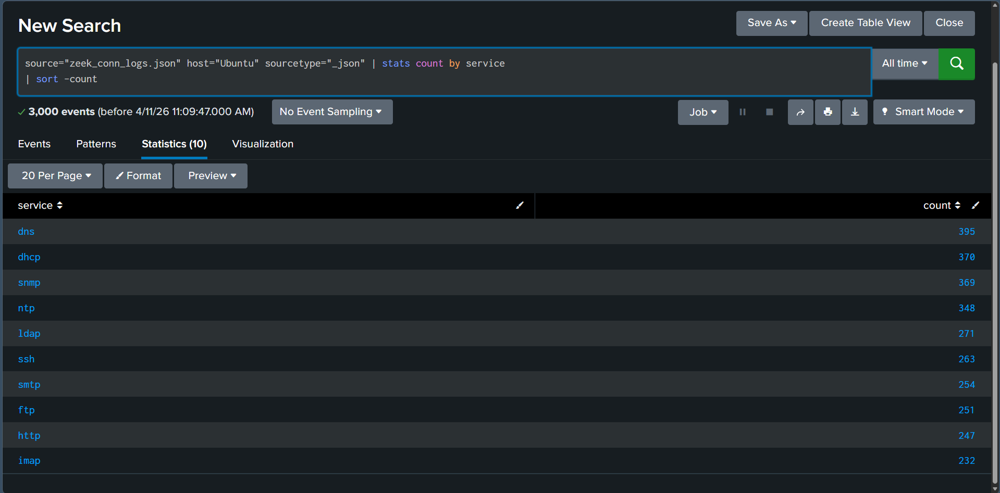
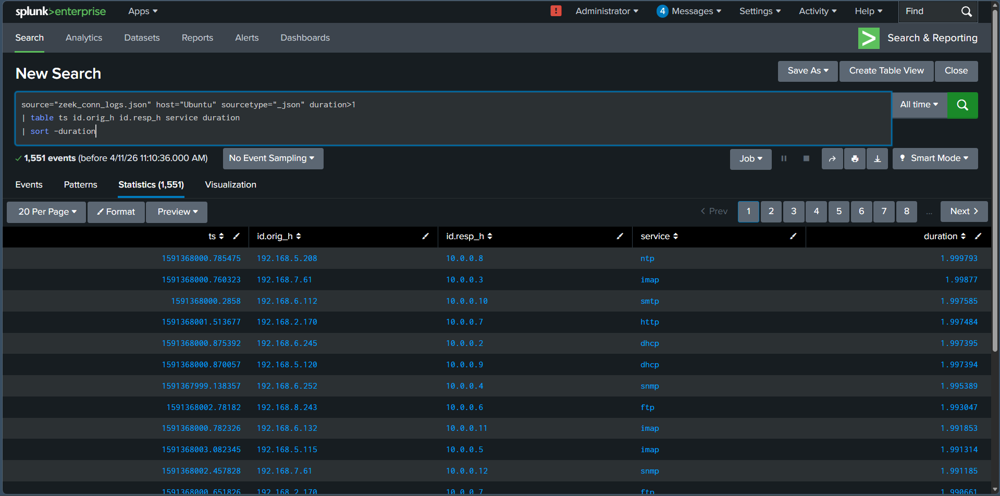
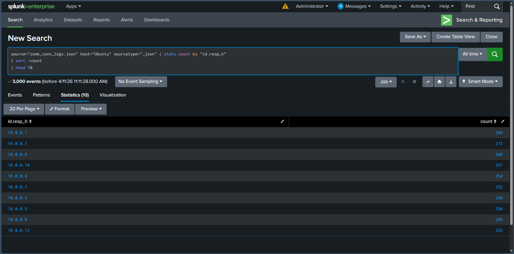

# Zeek Connection Log Analysis Using Splunk

## Objective

The objective of this lab was to ingest Zeek connection logs into Splunk and analyze network connection data using Search Processing Language (SPL). The lab focused on identifying the most active client IP addresses, common network services, long-duration connections, and the most frequently accessed internal servers.

---

## What is Zeek Connection Log Analysis?

Zeek connection logs (`conn.log`) record metadata about network connections, including source and destination IP addresses, protocols, services, connection duration, and transferred bytes. These logs provide valuable visibility into network activity and help SOC analysts detect suspicious communication patterns, unusual services, long-lived connections, and potential lateral movement.

---

## Lab Environment

| Component     | Details              |
| ------------- | -------------------- |
| SIEM Platform | Splunk Enterprise    |
| Data Source   | Zeek Connection Logs |
| Log Format    | JSON                 |
| Index         | `conn_lab`           |
| Sourcetype    | `json`               |

---

## SPL Queries Used

### Task 1 – Top 10 Client IP Addresses

```spl
index=conn_lab sourcetype="json"
| stats count by id.orig_h
| sort -count
| head 10
```

### Task 2 – Most Common Network Services

```spl
index=conn_lab sourcetype="json"
| stats count by service
| sort -count
```

### Task 3 – Connections with Duration Greater Than 1 Second

```spl
index=conn_lab sourcetype="json" duration>1
| table ts id.orig_h id.resp_h service duration
| sort -duration
```

### Task 4 – Most Accessed Internal Servers

```spl
index=conn_lab sourcetype="json"
| stats count by "id.resp_h"
| sort -count
| head 10
```

---

## Lab Procedure

1. Uploaded the Zeek connection log file into Splunk.
2. Indexed the data using the `conn_lab` index with the `json` sourcetype.
3. Verified that the logs were successfully indexed.
4. Executed SPL queries to analyze network connection activity.
5. Identified the most active client IP addresses.
6. Reviewed the most frequently observed network services.
7. Investigated connections with durations exceeding one second.
8. Identified the internal servers receiving the highest number of connections.

---

## Observations

* Zeek connection logs were successfully ingested into Splunk.
* The most active client IP addresses were identified using statistical aggregation.
* Frequently used network services were observed from the connection metadata.
* Long-duration network connections were filtered for further investigation.
* Internal servers receiving the highest volume of connections were identified.

---

## SOC Analyst Perspective

Connection logs are one of the most valuable network telemetry sources during threat hunting and incident response. They help analysts identify unusual communication patterns, unexpected services, long-running sessions, and systems receiving excessive network traffic. Correlating connection metadata with other log sources improves visibility into suspicious network behavior.

---

## Key Learnings

* Learned how to ingest Zeek connection logs into Splunk.
* Used SPL queries to investigate network connection activity.
* Identified the most active client IP addresses.
* Analyzed commonly used network services.
* Investigated long-duration network connections.
* Identified the most frequently accessed internal servers.

---

## Conclusion

This lab demonstrated how Splunk can be used to analyze Zeek connection logs for network monitoring and security investigations. By examining client activity, service usage, connection duration, and destination servers, the exercise reinforced practical SIEM techniques used by SOC analysts to detect abnormal network behavior.

---

## 📸 Screenshots

### 1. Top 10 Client IP Addresses

The SPL query identified the client IP addresses generating the highest number of network connections.



---

### 2. Most Common Network Services

The query summarized the network services observed within the connection logs.



---

### 3. Long-Duration Network Connections

The SPL query filtered and displayed connections with a duration greater than one second for further investigation.



---

### 4. Most Accessed Internal Servers

The query identified the internal destination servers receiving the highest number of network connections.


