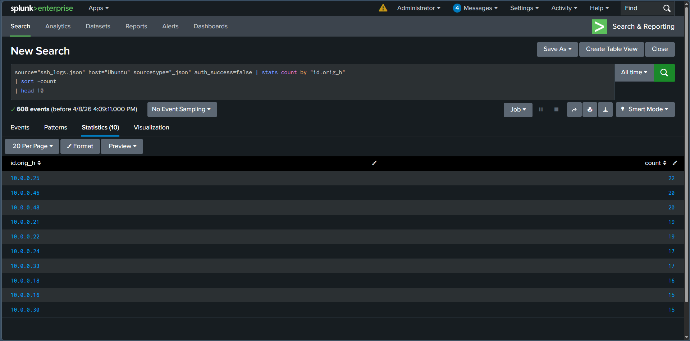
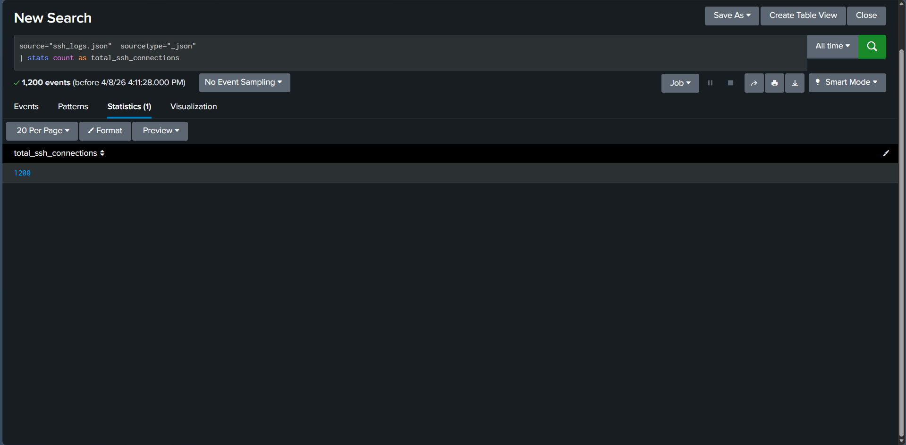
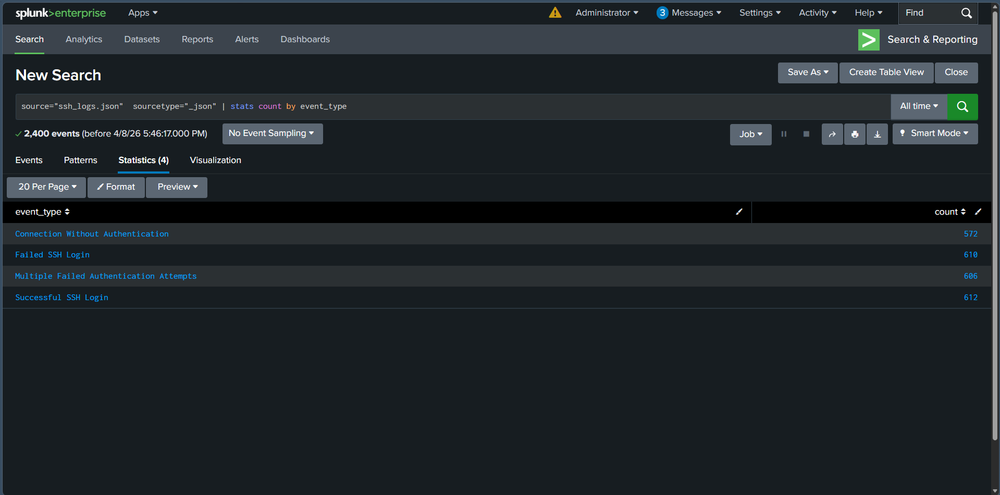

# SSH Log Analysis Using Splunk

## Objective

The objective of this lab was to ingest SSH logs into Splunk and analyze authentication activity using Search Processing Language (SPL). The lab focused on identifying hosts with failed SSH login attempts, determining the total number of SSH connections, and analyzing different SSH event types.

---

## What is SSH Log Analysis?

SSH log analysis involves monitoring Secure Shell (SSH) authentication events to detect suspicious login attempts, brute-force attacks, unauthorized access, and other anomalous activities. Reviewing SSH logs enables SOC analysts to identify compromised systems, investigate authentication failures, and improve overall security monitoring.

---

## Lab Environment

| Component     | Details           |
| ------------- | ----------------- |
| SIEM Platform | Splunk Enterprise |
| Data Source   | Zeek SSH Logs     |
| Log Format    | JSON              |
| Index         | `ssh_lab`         |
| Sourcetype    | `json`            |

---

## SPL Queries Used

### Task 1 – Top 10 Endpoints with Failed SSH Login Attempts

```spl
index=ssh_lab sourcetype="json" auth_success=false
| stats count by "id.orig_h"
| sort -count
| head 10
```

### Task 2 – Total SSH Connections

```spl
index=ssh_lab sourcetype="json"
| stats count as total_ssh_connections
```

### Task 3 – SSH Event Type Distribution

```spl
index=ssh_lab sourcetype="json"
| stats count by event_type
```

---

## Lab Procedure

1. Uploaded the Zeek SSH log file into Splunk.
2. Indexed the data using the `ssh_lab` index with the `json` sourcetype.
3. Verified that the SSH logs were successfully ingested.
4. Executed SPL queries to analyze SSH authentication activity.
5. Identified the endpoints with the highest number of failed SSH login attempts.
6. Calculated the total number of SSH connections recorded in the dataset.
7. Reviewed the distribution of SSH event types.

---

## Observations

* SSH logs were successfully ingested and searchable in Splunk.
* Failed authentication attempts were grouped by source IP address to identify the most active endpoints.
* The total number of SSH connections was calculated using an aggregate SPL query.
* Different SSH event types were categorized to better understand authentication activity within the dataset.

---

## SOC Analyst Perspective

SSH logs are an important source of authentication data during security monitoring and incident response. Frequent failed login attempts may indicate brute-force attacks or password spraying, while unusual authentication patterns can suggest unauthorized access attempts. Continuous monitoring of SSH activity helps SOC analysts detect and respond to suspicious behavior before systems are compromised.

---

## Key Learnings

* Learned how to ingest Zeek SSH logs into Splunk.
* Used SPL to investigate SSH authentication activity.
* Identified endpoints responsible for failed SSH login attempts.
* Calculated the total number of SSH connections.
* Analyzed different SSH event types using statistical queries.
* Strengthened practical skills in authentication log analysis using Splunk.

---

## Conclusion

This lab demonstrated how Splunk can be used to investigate SSH authentication activity through Zeek SSH logs. By analyzing failed login attempts, total SSH connections, and event type distributions, the exercise reinforced fundamental SIEM investigation techniques used by SOC analysts to detect suspicious authentication behavior.

---

## 📸 Screenshots

### 1. Top 10 Endpoints with Failed SSH Login Attempts

The SPL query identified the source IP addresses responsible for the highest number of failed SSH authentication attempts.



---

### 2. Total SSH Connections

The query calculated the total number of SSH connections recorded in the ingested log dataset.



---

### 3. SSH Event Type Distribution

The SPL query categorized SSH events by event type to provide an overview of authentication activity.


