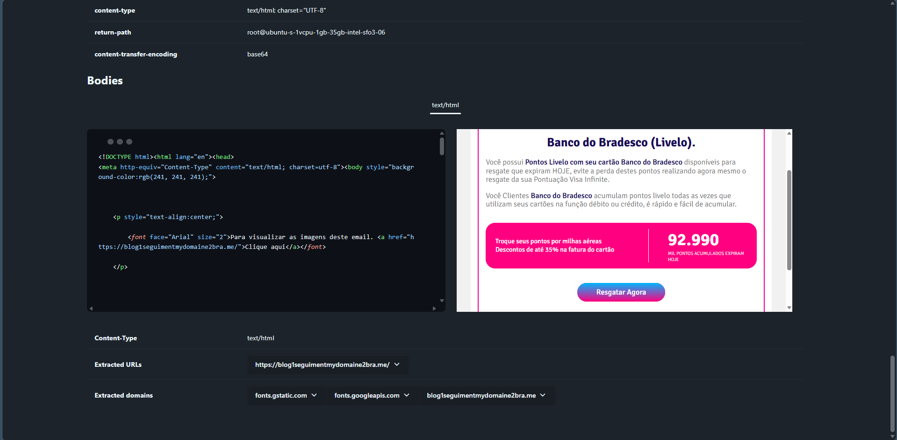
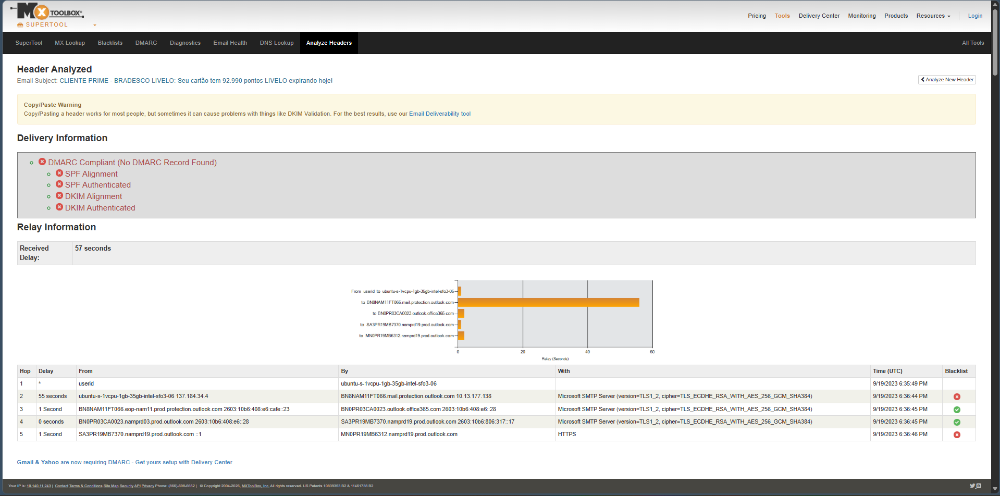
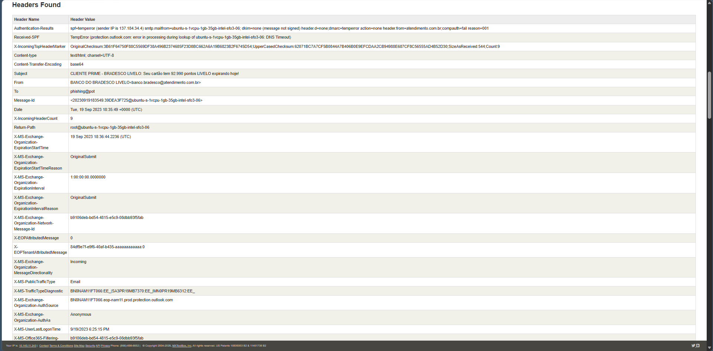
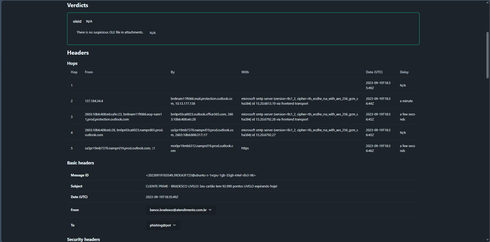
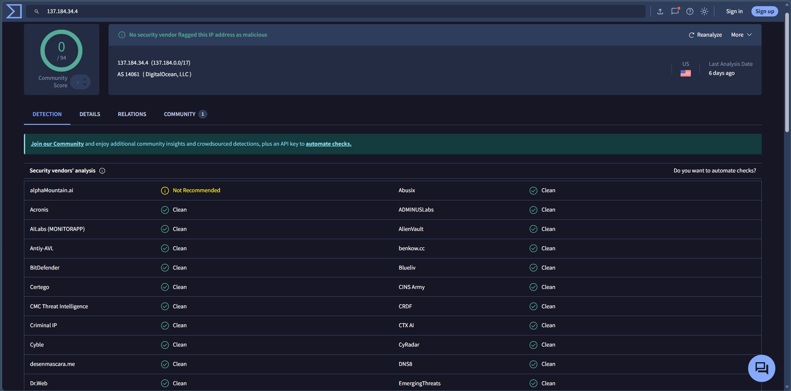

# Investigating a Phishing Email

## Objective

The objective of this lab was to investigate a phishing email by analyzing its headers, sender information, email body, embedded URLs, and sender IP reputation. The investigation focused on identifying Indicators of Compromise (IOCs) and determining whether the email exhibited characteristics commonly associated with phishing attacks.

---

## What is Phishing Email Analysis?

Phishing email analysis is the process of examining suspicious emails to determine their legitimacy and identify malicious indicators. Analysts inspect email headers, authentication results, embedded links, attachments, and sender reputation to understand how the email was delivered and whether it poses a security risk.

This process helps SOC analysts detect phishing campaigns, identify spoofed senders, and prevent credential theft or malware infections.

---

## Lab Environment

| Component | Details |
|----------|---------|
| Operating System | Windows |
| Email Sample | `.eml` File |
| Email Analysis Tools | EML Analyzer, MXToolbox |
| Reputation Analysis | VirusTotal |
| Investigation Focus | Header Analysis, IOC Extraction, Sender Validation |

---

## Investigation Procedure

1. Opened the provided phishing email sample using an EML analysis tool.
2. Reviewed the email headers to identify sender information and routing details.
3. Analyzed SPF, DKIM, and DMARC authentication results.
4. Examined the HTML email body and extracted embedded URLs.
5. Collected Indicators of Compromise (IOCs), including domains, URLs, and sender IP address.
6. Verified the sender IP reputation using VirusTotal.
7. Documented the findings and assessed whether the email showed phishing characteristics.

---

## Indicators of Compromise (IOCs)

### Sender Email

```text
banco.bradesco@atendimento.com.br
```

### Sender Domain

```text
atendimento.com.br
```

### Sender IP Address

```text
137.184.34.4
```

### Suspicious URL

```text
https://blog1seguimentmydomaine2bra.me/
```

---

## Observations

- The email impersonated **Banco do Bradesco Livelo** using a reward points expiration theme to create urgency.
- Email authentication analysis showed issues with SPF, DKIM, and DMARC validation, indicating that the sender could not be fully authenticated.
- The email contained an embedded URL that should be verified before being trusted.
- The sender IP address was investigated using VirusTotal as part of the reputation analysis.
- Email header analysis provided valuable information about the sender, relay path, authentication status, and message metadata.

---

## SOC Analyst Perspective

Phishing investigations require validating both the technical metadata and the social engineering techniques used within an email. During analysis, SOC analysts examine authentication results, inspect sender infrastructure, identify suspicious URLs, and validate Indicators of Compromise using threat intelligence platforms. Even when an IP address is not currently flagged as malicious, authentication failures and suspicious email content should be treated as indicators requiring further investigation.

---

## Key Learnings

- Learned how to investigate phishing emails using multiple analysis tools.
- Analyzed email headers to identify sender information and authentication results.
- Extracted Indicators of Compromise (IOCs) from the email body.
- Verified sender IP reputation using VirusTotal.
- Understood the importance of SPF, DKIM, and DMARC validation during phishing investigations.
- Strengthened practical skills in email threat analysis and IOC validation.

---

## Conclusion

This lab demonstrated the complete process of investigating a phishing email using manual analysis techniques. By reviewing email headers, authentication results, sender reputation, and embedded URLs, the investigation provided practical experience in identifying phishing indicators and validating potential threats using industry-standard security tools.

---

## 📸 Screenshots

### 1. Email Body Analysis and IOC Extraction

The phishing email body was analyzed to identify embedded content, extract suspicious URLs, and collect potential Indicators of Compromise (IOCs).



---

### 2. Email Header Authentication Analysis

MXToolbox was used to analyze the email headers and review delivery information, including SPF, DKIM, and DMARC authentication results.



---

### 3. Detailed Email Header Information

The email headers were reviewed to identify sender information, return path, message ID, subject, and authentication details.



---

### 4. EML File Analysis

The phishing email was analyzed using an EML analysis tool to examine message headers, delivery hops, and overall email structure.



---

### 5. Sender IP Reputation Analysis

The sender IP address was investigated using VirusTotal to evaluate its reputation and determine whether it had been reported as malicious.


