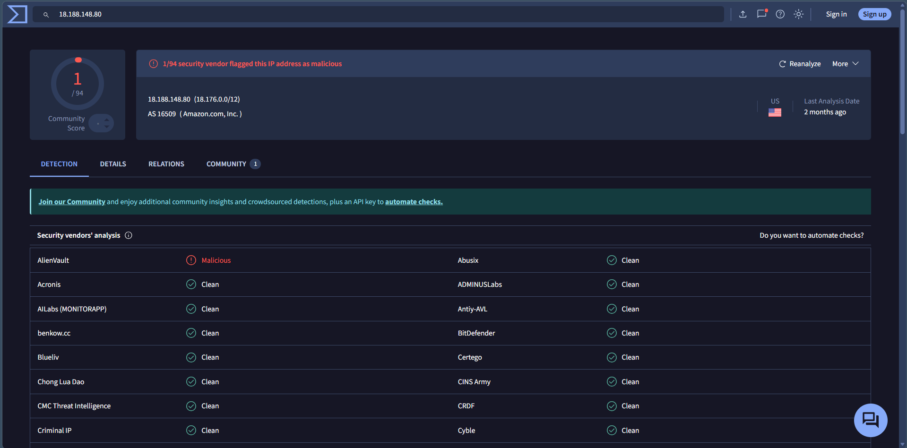
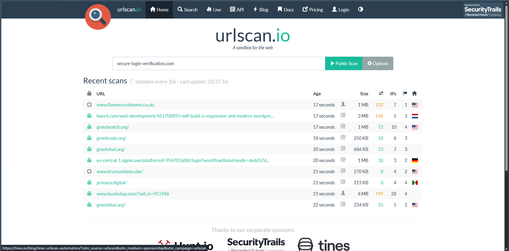
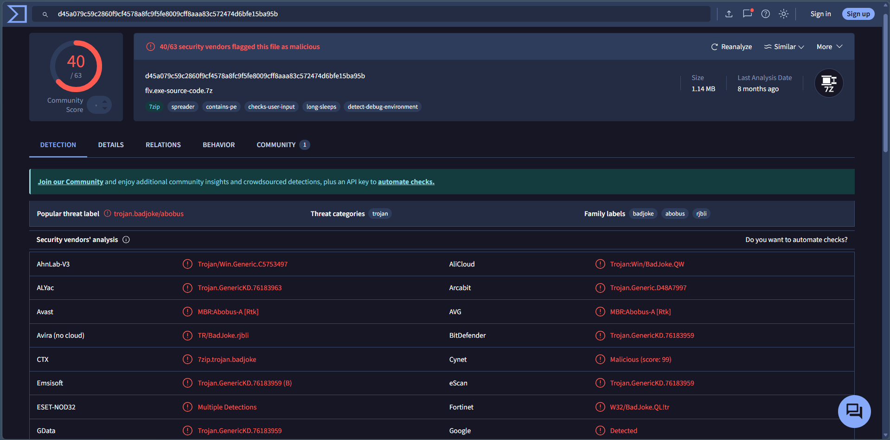
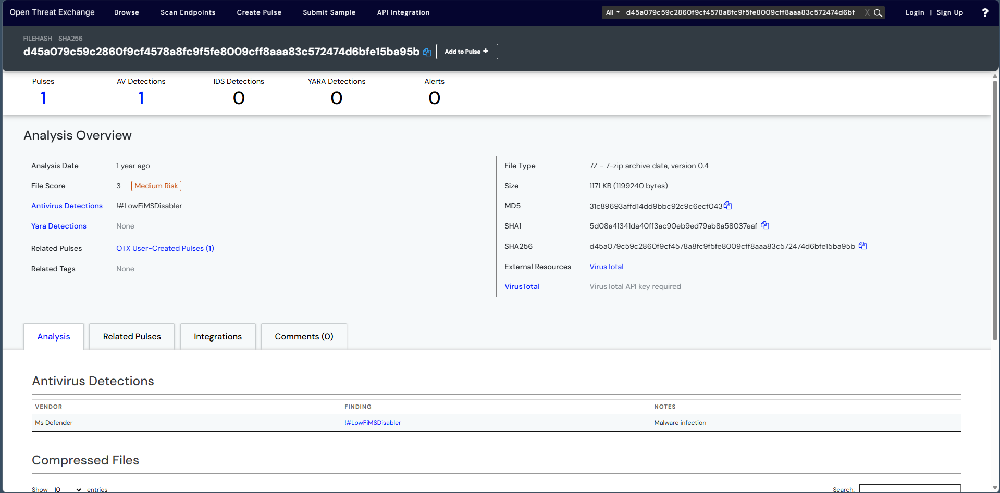

# Threat Intelligence Basics

## Objective

The objective of this lab was to investigate Indicators of Compromise (IOCs) extracted from a suspicious email using publicly available threat intelligence platforms. The investigation focused on validating an IP address, domain, and file hash to understand their reputation and identify potential malicious activity.

---

## What is Threat Intelligence?

Threat Intelligence (TI) is the collection, analysis, and sharing of information about cyber threats, threat actors, and Indicators of Compromise (IOCs). It enables SOC analysts to quickly assess suspicious artifacts, understand ongoing threats, and make informed incident response decisions.

Threat intelligence is commonly categorized into:

- **Tactical Intelligence:** IP addresses, domains, URLs, hashes, and other IOCs.
- **Operational Intelligence:** Information about malware campaigns, attacker infrastructure, and threat actor activities.
- **Strategic Intelligence:** High-level threat trends, industry targeting, and geopolitical cyber risks.

---

## Lab Environment

| Component | Details |
|----------|---------|
| Operating System | Windows |
| Threat Intelligence Tools | VirusTotal, AbuseIPDB, URLScan.io, AlienVault OTX, ThreatFox, MXToolbox |
| Investigation Focus | IOC Validation |
| Indicators Investigated | IP Address, Domain, SHA256 File Hash |

---

## Indicators of Compromise (IOCs)

### Suspicious IP Address

```text
18.188.148.80
```

### Suspicious Domain

```text
aaronthompson.ug
```

### SHA256 File Hash

```text
d45a079c59c2860f9cf4578a8fc9f5fe8009cff8aaa83c572474d6bfe15ba95b
```

---

## Investigation Procedure

1. Identified the Indicators of Compromise from the phishing investigation.
2. Investigated the suspicious IP address using threat intelligence platforms.
3. Verified the reputation and details of the suspicious domain.
4. Analyzed the SHA256 file hash to determine file type, detection ratio, and associated malware.
5. Reviewed additional threat intelligence feeds for related campaigns or threat context.
6. Documented the findings and assessed the overall risk of the identified IOCs.

---

## Observations

- Public threat intelligence platforms provided contextual information about each IOC.
- IP reputation analysis helped determine whether the IP had been associated with malicious activity.
- Domain reputation analysis identified registration and reputation details useful during investigations.
- Hash analysis provided malware detection information, file type, and threat classification.
- Threat intelligence feeds offered additional context that could assist during incident response.

---

## SOC Analyst Perspective

Threat intelligence platforms enable SOC analysts to rapidly enrich Indicators of Compromise during investigations. Correlating IP addresses, domains, and file hashes with external intelligence sources helps validate alerts, prioritize incidents, identify malware families, and understand attacker infrastructure. IOC enrichment is a fundamental step in effective incident response and threat hunting.

---

## Key Learnings

- Learned how to investigate Indicators of Compromise using multiple threat intelligence platforms.
- Performed IP reputation analysis.
- Investigated suspicious domain reputation.
- Analyzed a SHA256 file hash using VirusTotal.
- Understood how threat intelligence supports incident response and threat hunting.
- Improved IOC validation and documentation skills.

---

## Conclusion

This lab demonstrated how threat intelligence platforms can be used to investigate suspicious Indicators of Compromise extracted from phishing investigations. By validating IP addresses, domains, file hashes, and reviewing external threat intelligence, the investigation provided valuable context that supports faster and more informed security decisions.

---

## 📸 Screenshots

### 1. IP Lookup

The suspicious IP address was investigated using a threat intelligence platform to review its reputation, geographic information, and detection status.



---

### 2. Domain Lookup

The suspicious domain was analyzed to review its reputation, registration details, and associated security findings.



---

### 3. Hash Analysis

The SHA256 file hash was analyzed to determine the file type, malware detection results, and any associated malware family.



---

### 4. Threat Intelligence Feed

Additional context about the IOC was reviewed using a threat intelligence feed to identify related campaigns, tags, and threat information.


