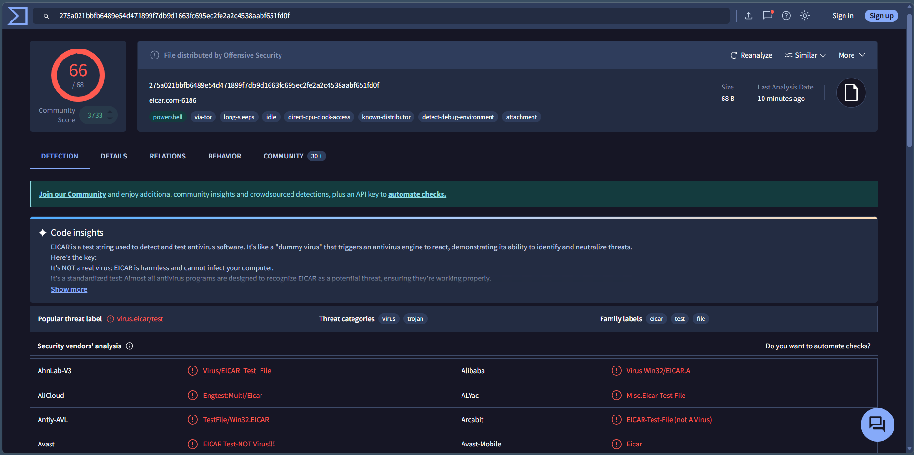
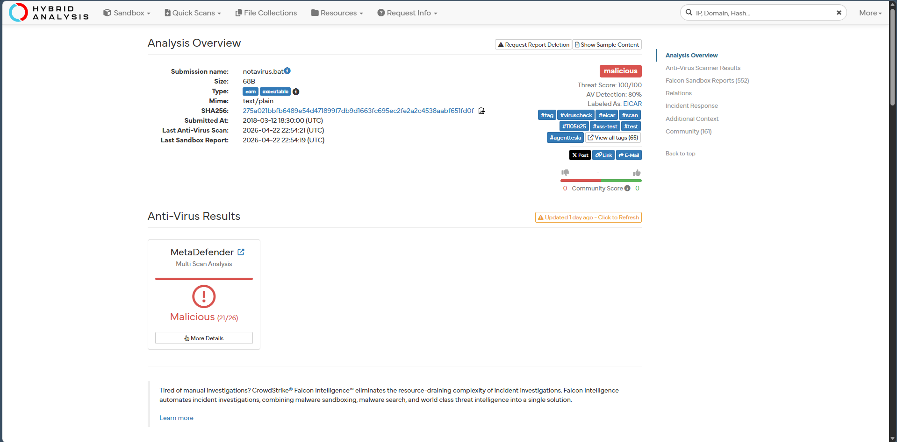
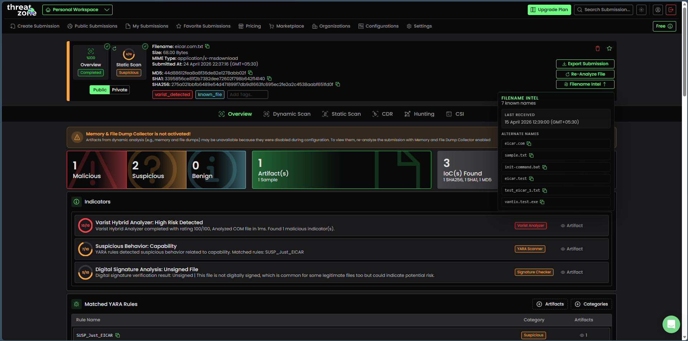
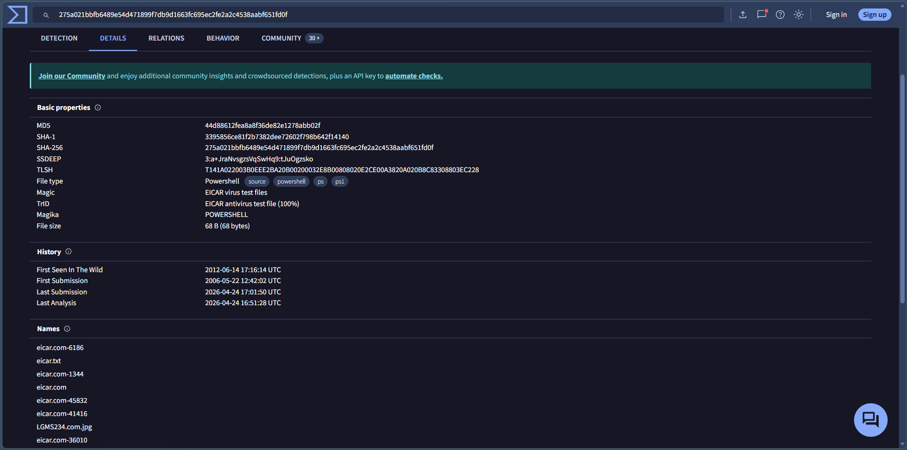

# Introduction to Malware Analysis

## Objective

The objective of this lab was to perform basic static malware analysis using the EICAR test file. The investigation focused on identifying file hashes, file type, antivirus detections, and threat intelligence information using publicly available malware analysis platforms without executing the sample.

---

## What is Malware Analysis?

Malware analysis is the process of examining suspicious files to determine their purpose, behavior, and potential impact. It helps SOC analysts identify threats, extract Indicators of Compromise (IOCs), improve detection capabilities, and support incident response activities.

Common types of malware analysis include:

- **Static Analysis** – Examining a file without executing it.
- **Dynamic Analysis** – Observing file behavior inside a controlled sandbox.
- **Memory Analysis** – Investigating malware artifacts from system memory.
- **Reverse Engineering** – Studying malware code to understand its functionality.

---

## Lab Environment

| Component | Details |
|-----------|---------|
| Operating System | Windows |
| Sample | EICAR Test File (Safe Test Malware) |
| Analysis Type | Static Malware Analysis |
| Tools Used | VirusTotal, Hybrid Analysis, ThreatZone, Hex Viewer |

---

## Investigation Procedure

1. Obtained the EICAR test malware sample.
2. Uploaded the sample to VirusTotal to review antivirus detections and file information.
3. Examined the file properties, hashes, and metadata.
4. Performed additional analysis using Hybrid Analysis.
5. Reviewed the sample in ThreatZone for static analysis results.
6. Documented the observed Indicators of Compromise (IOCs) and detection results.

---

## Observations

- The EICAR sample was successfully recognized by multiple antivirus engines.
- VirusTotal identified the sample as an EICAR antivirus test file.
- Hybrid Analysis classified the sample as malicious for testing purposes.
- Static analysis revealed the file hashes, file size, file type, and associated metadata.
- The investigation demonstrated how threat intelligence platforms provide valuable context without executing the sample.

---

## SOC Analyst Perspective

Static malware analysis is often the first step in investigating suspicious files received through phishing emails, downloads, or endpoint alerts. By validating hashes, reviewing antivirus detections, and extracting file metadata, SOC analysts can quickly determine whether a file requires escalation or further dynamic analysis while minimizing operational risk.

---

## Key Learnings

- Understood the fundamentals of static malware analysis.
- Learned how to analyze suspicious files without execution.
- Verified malware detections using multiple threat intelligence platforms.
- Reviewed file metadata, hashes, and antivirus detection results.
- Improved malware investigation and documentation skills.

---

## Conclusion

This lab demonstrated the basic workflow of static malware analysis using the EICAR test file. Multiple analysis platforms were used to examine the sample, validate antivirus detections, and collect forensic information without executing the file. This approach reflects the initial triage process commonly performed by SOC analysts during malware investigations.

---

## 📸 Screenshots

### VirusTotal Detection Results

Shows the antivirus detection ratio and overall classification of the uploaded EICAR sample.

---

### Hybrid Analysis Overview

Displays the Hybrid Analysis report including malware classification, detection score, and analysis summary.

---

### ThreatZone Static Analysis

Shows additional static malware analysis findings, indicators, and threat assessment.

---

### VirusTotal File Details

Displays detailed file metadata including hashes, file type, size, and additional properties extracted during analysis.

