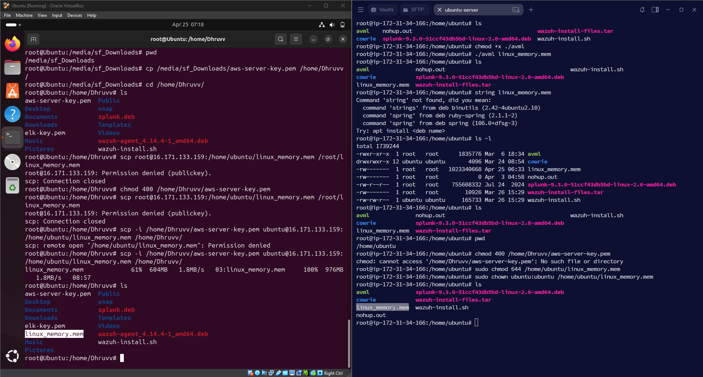

# Introduction to Digital Forensics

## Objective

The objective of this lab was to acquire a live Linux memory dump using Microsoft's AVML (Acquire Volatile Memory for Linux), perform basic validation of the captured memory, and securely transfer the memory image to another Linux system for future forensic analysis.

---

## What is Digital Forensics?

Digital Forensics is the process of identifying, preserving, collecting, analyzing, and reporting digital evidence during cybersecurity investigations. Memory forensics is particularly valuable because it captures volatile data such as running processes, active network connections, loaded modules, and encryption keys that would otherwise be lost after a system shutdown.

---

## Lab Environment

| Component | Details |
|-----------|---------|
| Target System | Ubuntu Linux |
| Analysis System | Ubuntu Linux |
| Memory Acquisition Tool | Microsoft AVML |
| Transfer Method | SCP (Secure Copy) |
| Validation Tools | ls, chmod, strings (attempted) |

---

## Commands Used

```bash
chmod +x ./avml

./avml linux_memory.mem

ls -l

scp -i /home/Dhruvv/aws-server-key.pem ubuntu@16.171.133.159:/home/ubuntu/linux_memory.mem /home/Dhruvv/

sudo chmod 644 /home/ubuntu/linux_memory.mem

sudo chown ubuntu:ubuntu /home/ubuntu/linux_memory.mem
```

---

## Lab Procedure

1. Downloaded the AVML memory acquisition tool on the target Ubuntu system.
2. Granted execute permission to the AVML binary.
3. Executed AVML to capture the live memory and generate the `linux_memory.mem` memory image.
4. Verified that the memory dump was successfully created.
5. Attempted to validate the memory dump before transfer.
6. Used SCP to securely transfer the memory image from the target machine to the analysis workstation.
7. Adjusted file ownership and permissions to allow successful file transfer.
8. Verified that the memory image was successfully copied to the destination system.

---

## Observations

- AVML successfully created the Linux memory dump.
- Initial SCP attempts failed because of SSH authentication and file permission issues.
- After correcting file permissions and ownership, the memory image was transferred successfully.
- The acquired memory image was available on the analysis workstation for future forensic investigation.

---

## SOC Analyst Perspective

Memory acquisition is an essential step during incident response because volatile evidence is lost after a reboot or shutdown. Capturing RAM enables investigators to analyze running processes, active network connections, injected code, malware artifacts, and other volatile evidence that may not exist on disk. Proper handling and preservation of memory images help maintain forensic integrity throughout an investigation.

---

## Key Learnings

- Learned how to acquire a live Linux memory image using Microsoft AVML.
- Understood the importance of preserving volatile evidence.
- Practiced securely transferring forensic evidence using SCP.
- Identified and resolved common permission issues encountered during forensic acquisition.
- Gained hands-on experience with the initial phase of Linux memory forensics.

---

## Conclusion

This lab demonstrated the complete workflow of acquiring a live Linux memory image using AVML, validating the acquisition process, resolving permission-related issues, and transferring the forensic evidence to a separate analysis workstation. These activities represent an important first step in digital forensic investigations and incident response.

---

## 📸 Screenshots

### Linux Memory Acquisition and Secure Transfer

The screenshot shows the successful creation of a Linux memory dump using Microsoft AVML, verification of the generated memory image, troubleshooting of SCP permission issues, and the successful transfer of the memory dump from the target Ubuntu system to the forensic analysis workstation.


