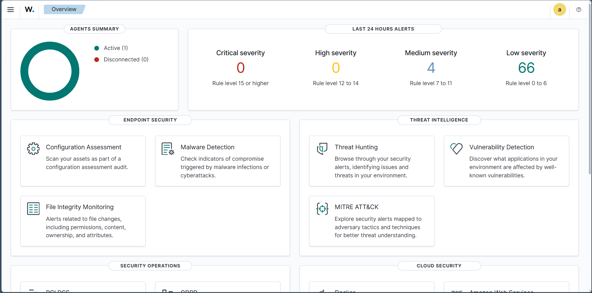
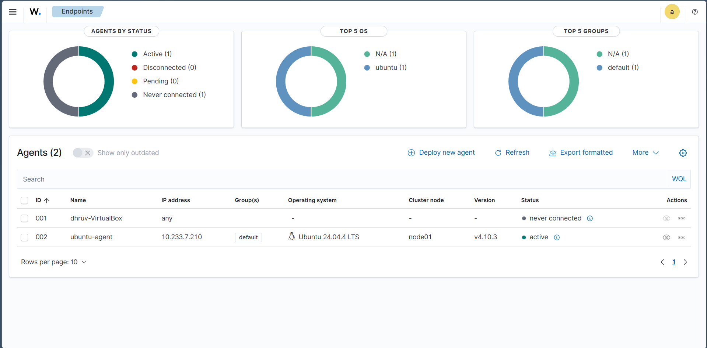
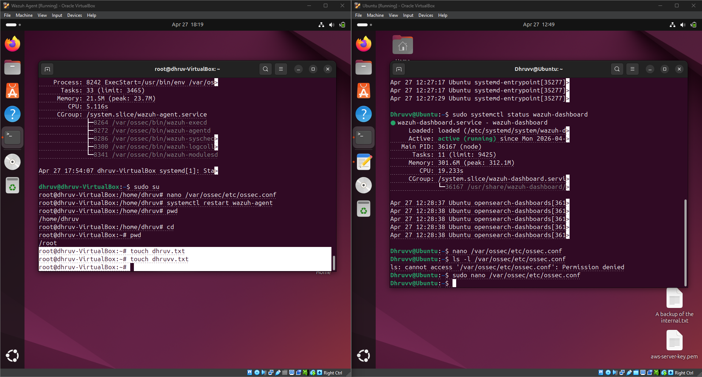
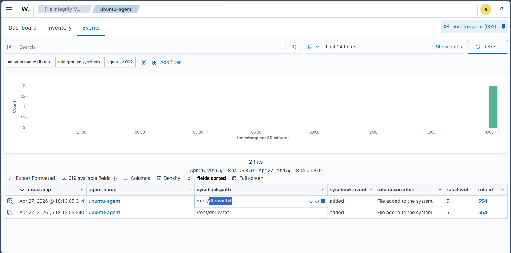
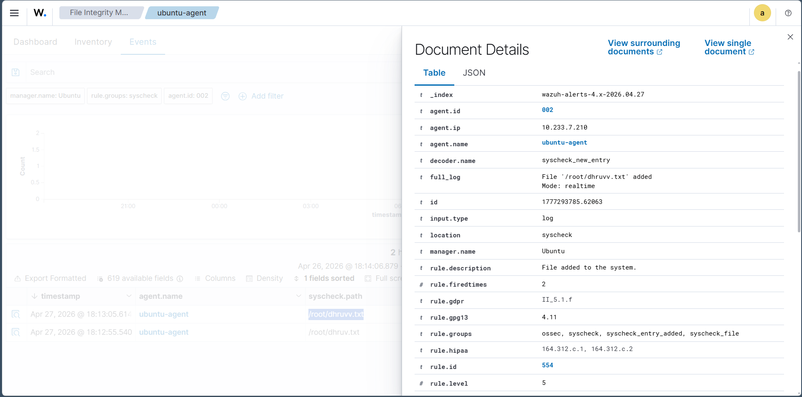
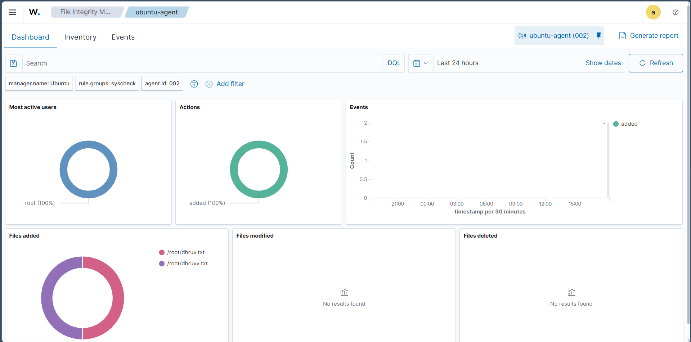

# Wazuh File Integrity Monitoring (FIM)

## Objective

The objective of this lab was to configure File Integrity Monitoring (FIM) using Wazuh, monitor file system changes on a Linux endpoint, and investigate file creation events through the Wazuh Dashboard. This exercise demonstrates how SOC analysts can detect unauthorized file modifications and validate security events using endpoint telemetry.

---

## What is File Integrity Monitoring (FIM)?

File Integrity Monitoring (FIM) is a security capability that continuously monitors files and directories for unauthorized changes. It detects events such as file creation, modification, deletion, and permission changes, enabling SOC analysts to identify potential malicious activity, unauthorized access, or policy violations.

FIM is commonly used to protect critical system files, configuration files, and sensitive directories from tampering.

---

## Lab Environment

| Component          | Details                         |
| ------------------ | ------------------------------- |
| Wazuh Manager      | Ubuntu Server                   |
| Endpoint           | Ubuntu Linux                    |
| Monitoring Feature | File Integrity Monitoring (FIM) |
| Dashboard          | Wazuh Dashboard                 |
| Agent              | Wazuh Agent                     |

---

## Commands Used

```bash
sudo nano /var/ossec/etc/ossec.conf

sudo systemctl restart wazuh-agent

touch dhruv.txt

touch dhruvv.txt
```

---

## Lab Procedure

1. Verified that the Wazuh Dashboard was operational.
2. Confirmed the Ubuntu endpoint was successfully registered with the Wazuh Manager.
3. Reviewed the Wazuh agent configuration file.
4. Restarted the Wazuh agent to apply the configuration.
5. Created sample files on the monitored endpoint to generate File Integrity Monitoring events.
6. Opened the Wazuh Dashboard and reviewed generated File Integrity Monitoring alerts.
7. Investigated the alert details and verified the recorded file creation events.

---

## Observations

* The Wazuh Manager and Dashboard were operating successfully.
* The Ubuntu endpoint communicated successfully with the Wazuh Manager.
* File creation events generated by the endpoint were detected by the File Integrity Monitoring module.
* Wazuh recorded detailed information including the affected file, agent information, rule description, and event timestamp.
* The File Integrity Monitoring dashboard summarized the detected events and related activity.

---

## SOC Analyst Perspective

File Integrity Monitoring provides visibility into unauthorized changes occurring on monitored systems. By reviewing FIM alerts, SOC analysts can quickly identify unexpected file activity, investigate the affected endpoint, determine whether the changes are legitimate, and initiate incident response procedures when unauthorized modifications are detected.

---

## Key Learnings

* Configured and verified Wazuh File Integrity Monitoring.
* Confirmed successful communication between the Wazuh Manager and endpoint agent.
* Generated file creation events for monitoring.
* Investigated File Integrity Monitoring alerts using the Wazuh Dashboard.
* Reviewed detailed alert information to validate detected file system activity.
* Strengthened practical knowledge of endpoint monitoring using Wazuh.

---

## Conclusion

This lab demonstrated the implementation of File Integrity Monitoring using Wazuh. By generating file creation events and investigating the resulting alerts, the exercise provided practical experience with endpoint monitoring and demonstrated how SOC analysts can detect and investigate file system changes using Wazuh.

---

## 📸 Screenshots

### 1. Wazuh Dashboard Overview

Verified that the Wazuh Dashboard was operational and monitoring connected endpoints.



---

### 2. Wazuh Agent Registration

Confirmed that the Ubuntu endpoint was successfully registered and communicating with the Wazuh Manager.



---

### 3. Wazuh Agent Configuration and Test File Creation

Reviewed the Wazuh agent configuration, restarted the service, and created sample files to generate File Integrity Monitoring events.



---

### 4. File Integrity Monitoring Events

Observed File Integrity Monitoring events generated after creating test files on the monitored endpoint.



---

### 5. File Integrity Monitoring Alert Details

Reviewed detailed alert information, including the affected file, rule description, agent information, and event metadata.



---

### 6. File Integrity Monitoring Dashboard Results

Analyzed the File Integrity Monitoring dashboard to review event summaries, actions, and monitored file activity.


