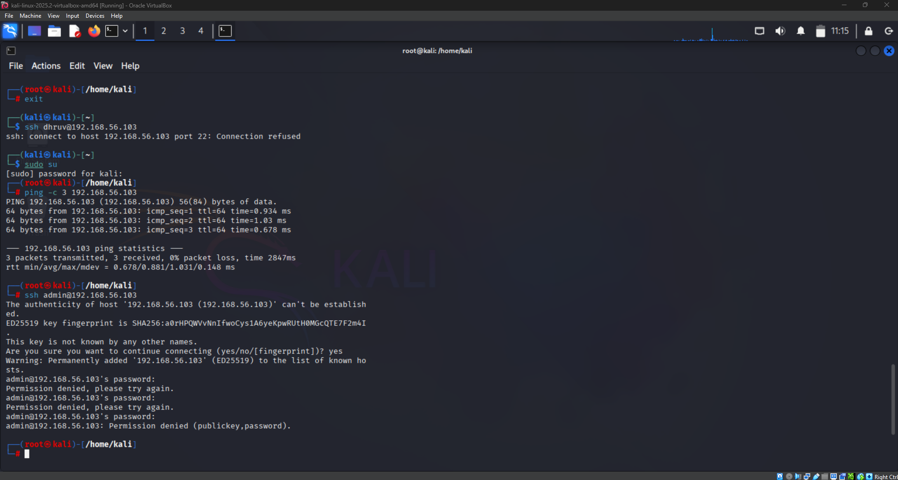
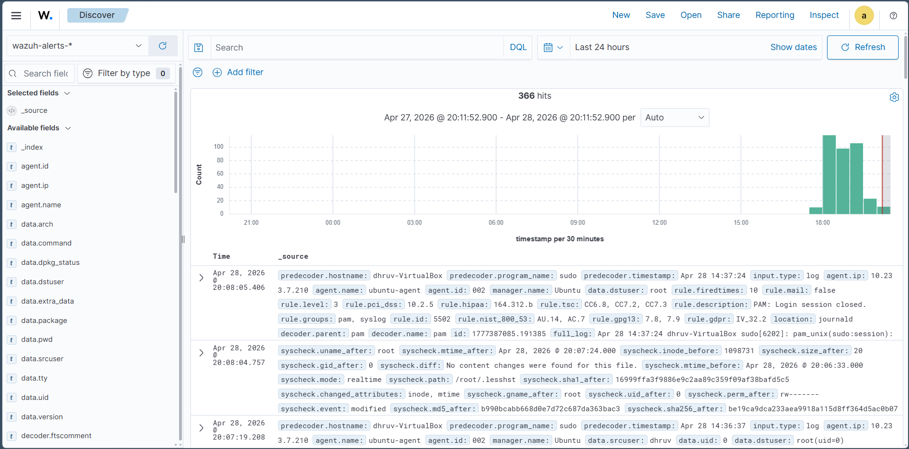
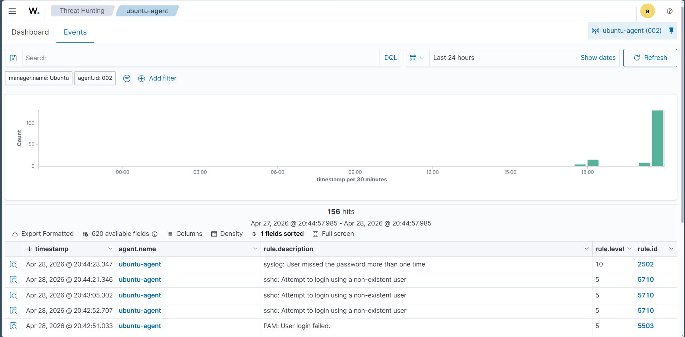
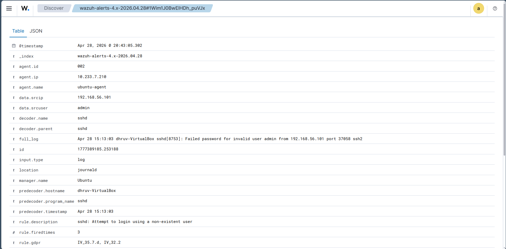
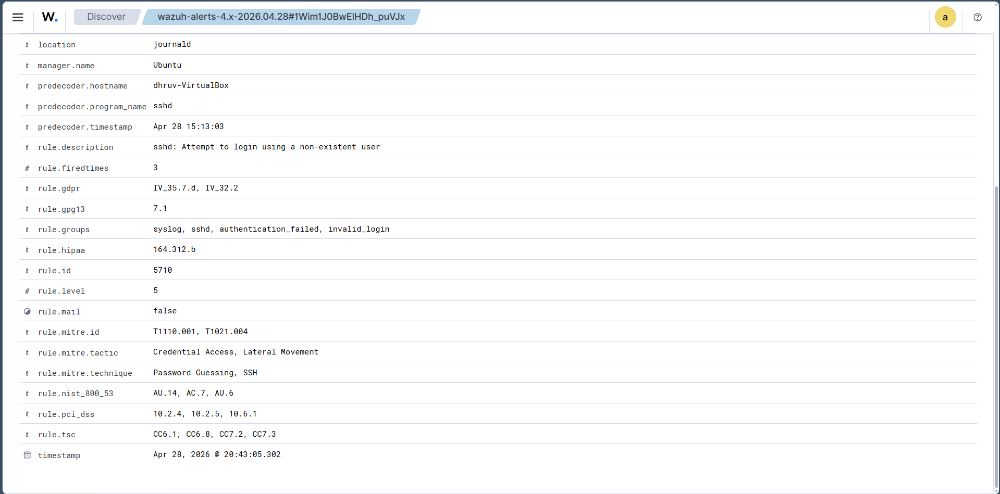
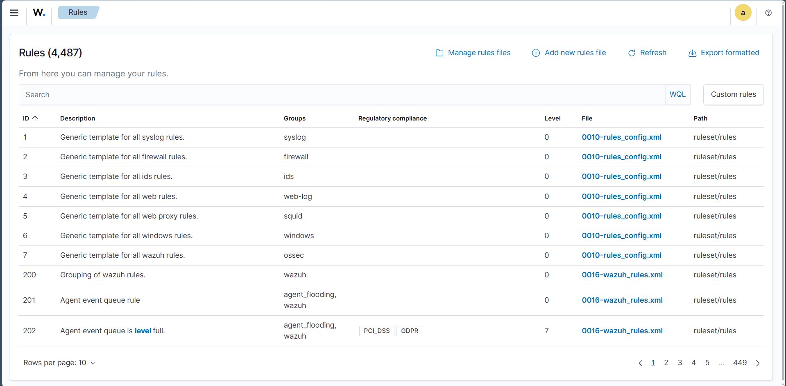

# EDR Basics: Detecting SSH Brute Force Attack

## 🎯 Objective

The objective of this lab was to simulate an SSH brute-force attack against an Ubuntu machine and monitor authentication events using Wazuh. This exercise demonstrates how SOC analysts detect failed login attempts, investigate security alerts, and analyze authentication logs through a SIEM platform.

---

## 🧠 Introduction

SSH brute-force attacks involve repeatedly attempting different username and password combinations to gain unauthorized access to a Linux system. Monitoring authentication logs helps security teams identify password guessing attacks before an attacker successfully compromises a system.

In this lab, a Kali Linux machine was used to simulate failed SSH login attempts against an Ubuntu target while Wazuh collected and generated security alerts.

---

## 🛠️ Lab Environment

| Component | Description |
|-----------|-------------|
| SIEM | Wazuh |
| Wazuh Manager | Ubuntu Server |
| Target Machine | Ubuntu Linux |
| Attacker Machine | Kali Linux |
| Attack Type | SSH Authentication Attack |

---

## 🔧 Steps Performed

1. Verified connectivity between the Kali attacker machine and the Ubuntu target.
2. Attempted SSH authentication using an invalid username.
3. Generated multiple failed SSH login attempts.
4. Allowed the Wazuh Agent to forward authentication logs.
5. Investigated generated alerts from the Wazuh Dashboard.
6. Reviewed event details, security rules, and MITRE ATT&CK mapping.

---

## 📊 Observations

- Network connectivity between attacker and target was successfully verified.
- Multiple failed SSH authentication attempts were generated.
- Wazuh successfully detected suspicious authentication activity.
- Authentication events included source IP address, username, severity level, and rule information.
- Wazuh mapped the attack to relevant MITRE ATT&CK techniques.
- All authentication events were centralized within the Wazuh Dashboard.

---

## 🎯 SOC Analyst Takeaway

Repeated failed SSH login attempts are a common indicator of brute-force attacks. Monitoring authentication logs through Wazuh enables SOC analysts to detect password guessing attempts, identify the attacking source, and investigate suspicious authentication activity before successful compromise occurs.

---

## 📚 Key Learnings

- Simulated SSH authentication attacks.
- Verified network communication between systems.
- Detected failed SSH login attempts using Wazuh.
- Investigated authentication alerts.
- Reviewed MITRE ATT&CK mappings.
- Improved understanding of SSH attack detection using SIEM.

---

## ✅ Conclusion

This lab demonstrated how Wazuh detects failed SSH authentication attempts and provides detailed security alerts for investigation. By monitoring authentication logs and correlating security events, SOC analysts can quickly identify brute-force activity and respond to potential credential attacks.

---

# 📸 Screenshots

## 02.1 SSH Login Attack from Kali

Kali Linux attempting SSH authentication against the Ubuntu target, generating failed login attempts.

---

## 02.2 Wazuh Authentication Events

Authentication-related events detected by Wazuh after the failed SSH login attempts.

---

## 02.3 Threat Hunting SSH Alerts

Threat Hunting view displaying SSH authentication alerts generated during the attack simulation.

---

## 02.4 SSH Alert Details

Detailed information about the detected SSH authentication event, including source IP, username, and rule description.

---

## 02.5 MITRE ATT&CK Mapping

MITRE ATT&CK techniques and security classifications associated with the detected authentication event.

---

## 02.6 Wazuh Rules Overview

Overview of Wazuh detection rules used for monitoring and classifying security events.

