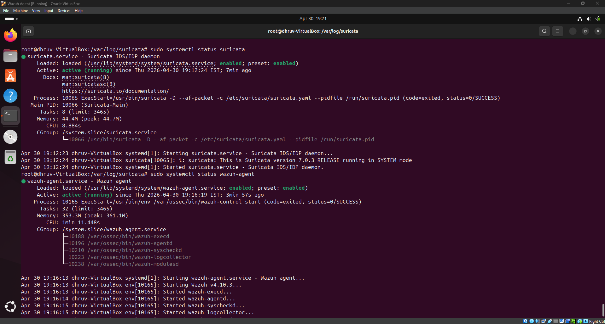
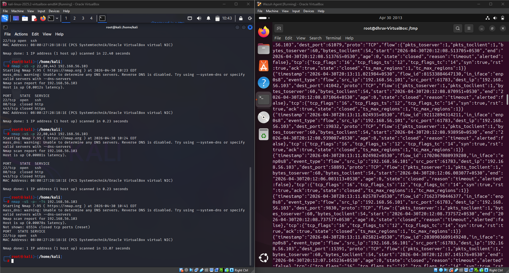
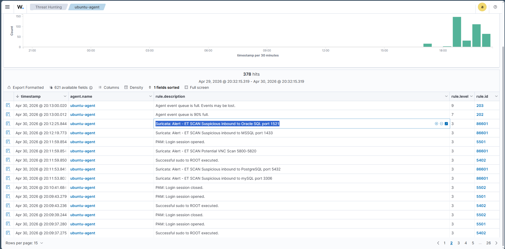
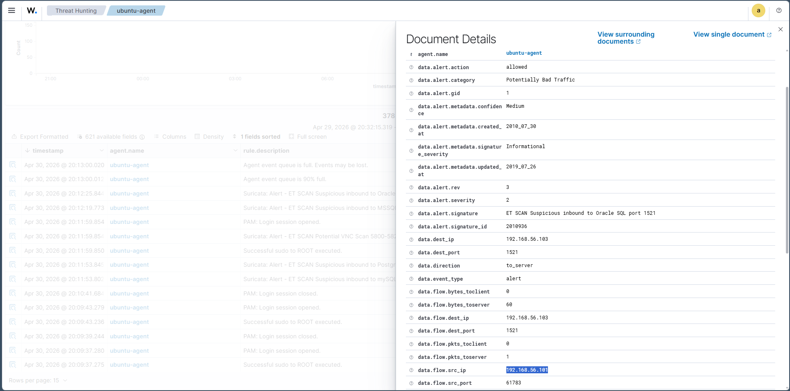

# EDR Basics – Detecting Suspicious Network Traffic Using Suricata

## Objective

The objective of this task was to integrate **Suricata IDS** with **Wazuh SIEM** to detect suspicious network traffic. A port scanning attack was simulated from a Kali Linux machine, and the generated alerts were collected and investigated through the Wazuh Dashboard.

---

## Lab Environment

| Component | Details |
|----------|---------|
| Wazuh Manager | Ubuntu Server |
| Wazuh Agent | Ubuntu 24.04 LTS |
| IDS | Suricata |
| Attacker Machine | Kali Linux |
| Attack Tool | Nmap |
| Monitoring Platform | Wazuh Dashboard |

---

## Implementation

### Step 1 – Verified Suricata and Wazuh Services

After installing and configuring Suricata, the status of both **Suricata** and the **Wazuh Agent** was verified to ensure that network events could be collected and forwarded successfully.

**Screenshot**



---

### Step 2 – Simulated Suspicious Network Traffic

From the Kali Linux machine, multiple **Nmap** scans were performed against the Ubuntu endpoint to simulate reconnaissance activity.

Commands executed:

```bash
nmap -sS -T4 192.168.56.103
```

At the same time, Suricata monitored the incoming traffic and generated events in the `eve.json` log file.

**Screenshot**



---

### Step 3 – Monitored Alerts in Wazuh

Once the scan was completed, the generated Suricata events were successfully ingested into Wazuh. The Threat Hunting dashboard displayed multiple IDS alerts corresponding to the detected network scan.

Observed alerts included:

- ET SCAN Potential VNC Scan
- ET SCAN Suspicious inbound MSSQL Port
- ET SCAN Suspicious inbound MySQL Port
- ET SCAN Suspicious inbound PostgreSQL Port
- ET SCAN Suspicious inbound Oracle SQL Port

**Screenshot**



---

### Step 4 – Investigated Alert Details

The generated alert was examined from the Wazuh Dashboard to review important information such as:

- Alert Signature
- Source IP Address
- Destination IP Address
- Destination Port
- Event Type
- Alert Severity
- Network Flow Details

This helped verify that the detected activity matched the simulated network reconnaissance performed from the Kali Linux machine.

**Screenshot**



---

## Results

- Successfully integrated **Suricata IDS** with the **Wazuh Agent**.
- Generated network events by performing an **Nmap SYN scan**.
- Successfully received and analyzed Suricata alerts in the Wazuh Dashboard.
- Verified detailed alert information including source IP, destination IP, destination port, and alert signature.
- Demonstrated how suspicious network reconnaissance can be detected and investigated using an IDS integrated with a SIEM platform.

---

## Conclusion

This task provided hands-on experience with **network-based threat detection** using **Suricata IDS** and **Wazuh SIEM**. By simulating a real-world port scanning attack, it was possible to observe how network events are captured, correlated, and presented for investigation. This practical exercise strengthened the understanding of IDS integration, alert monitoring, and network threat analysis from a SOC analyst's perspective.
